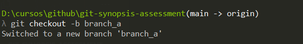
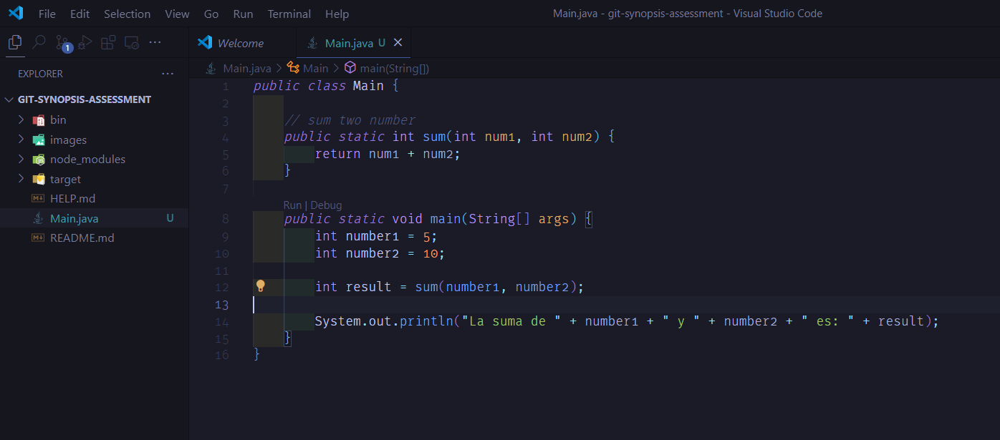
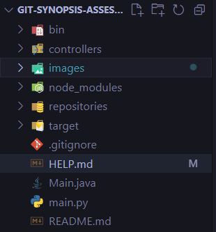
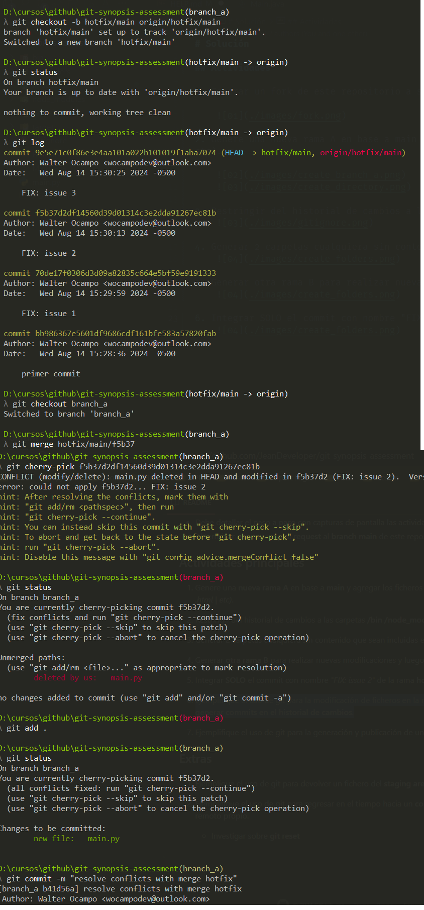
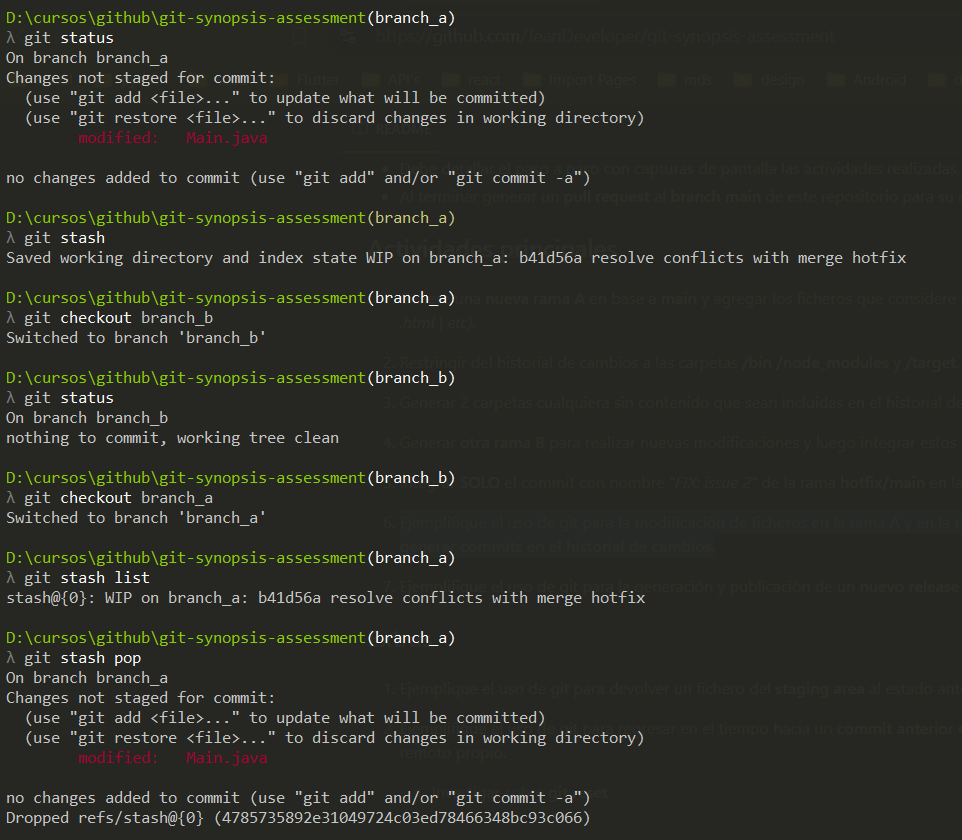
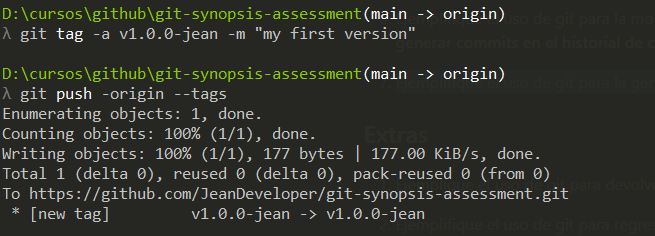
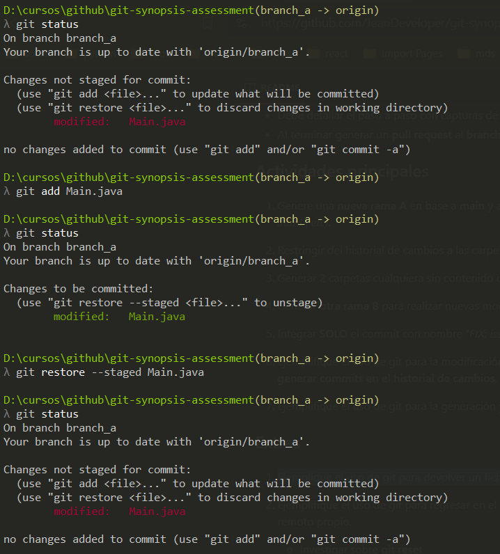
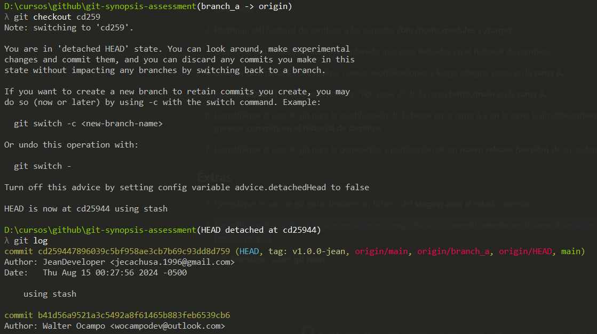

# Solución

## Actividades

1. Generar un fork de este repositorio a su propia cuenta de Github.

    

2. Genere una nueva rama A en base a main y agregar los ficheros que considere necesarios. (.js | .ts | .java | .cs | .html | etc).

    
    

3. Restringir del historial de cambios a las carpetas /bin /node_modules y /target.
    

4. Generar 2 carpetas cualquiera sin contenido que sean incluidas en el historial de cambios.
    

5. Generar otra rama B para realizar nuevas modificaciones y luego integrar estos en la rama A.
    

6. Integrar SOLO el commit con nombre "FIX: issue 2" de la rama hotfix/main en la rama A.
    

7. Ejemplifique el uso de git para la modificación de ficheros en la rama A y en la rama B simultaneamente sin generar commits  en el historial de cambios.
    

8. Ejemplifique el uso de git para la generación y publicación de un nuevo release (versión) de su código.
    

9. Ejemplique el uso de git para devolver un fichero del staging area al estado anterior.
    

10. Ejemplifique el uso de git para regresar en el tiempo hacia un commit anterior en la rama A de su repositorio remoto propio.
    

11. Investigar sobre el git reset
    - el "git reset" es para manipular el historial de commits en el repositorio, permite deshacer cambios de forma controlada, pero la bandera "--hard" debe de usarse con mucha precaucion ya que puede resulta una perdida irreversible de datos en el historial