# Solución

## Actividad 1

1. Genere la rama A y agregue 2 archivos
    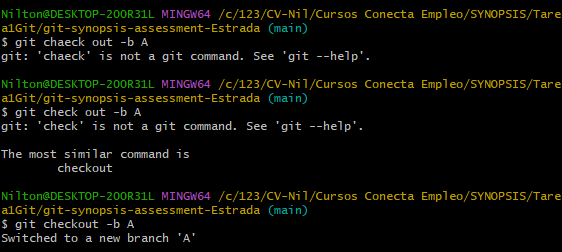
    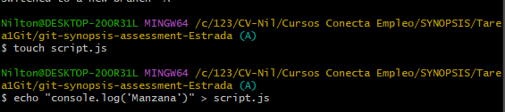
    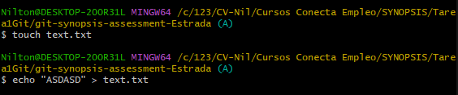
    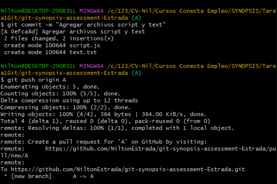

2. Restringi los cambios /bin /node_modules y /target haciendo uso de .gitignore
    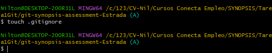
    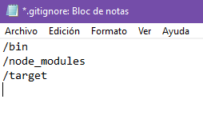
    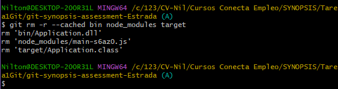
    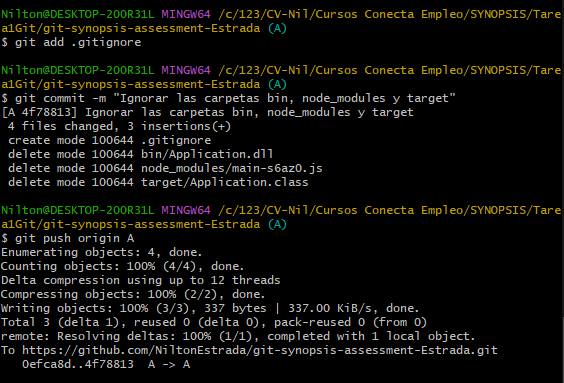
    
3. Genere 2 carpetas vacias
    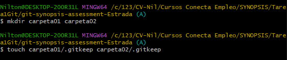
    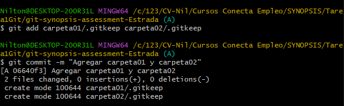
    

4. Genere la rama B y realice modificacioes dentro de la misma
    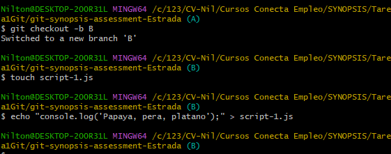
    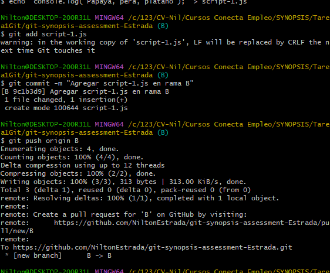
    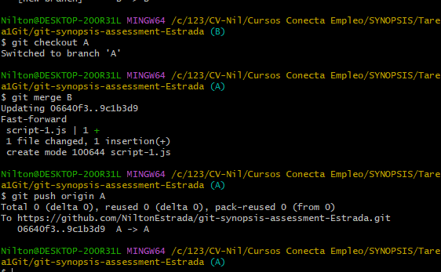
    
6. Hice uso de Git Stash para guardar los cambios temporalmente
    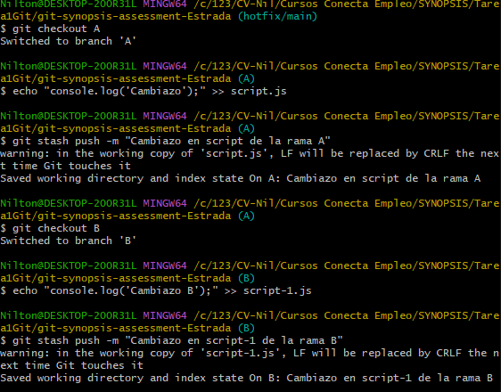
    
7. Hice uso de un tag para representar la version del codigo
    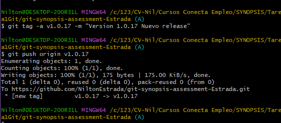
    
    