# Solución

## Actividad 1

1. Creación del Fork del repositorio git-synopsis-assessment.

    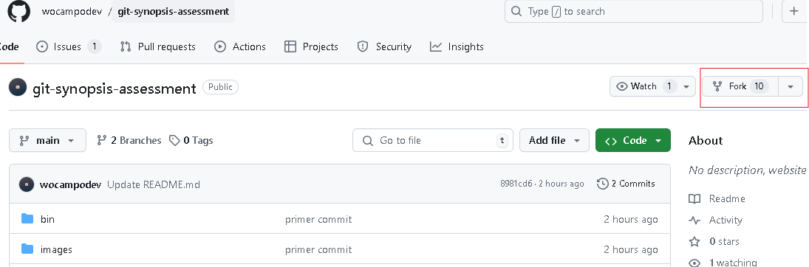
    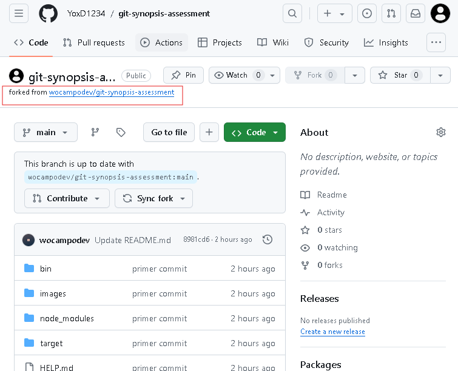

2. Tomando link HTTPS para clonar el repositorio en mi area local
    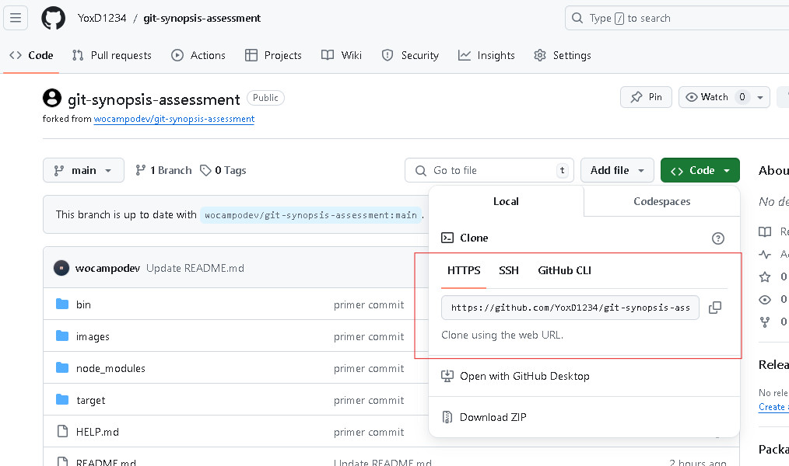

3. Inicializando git y realizando la clonación en el git bash, con el comando git clone y el link HTTPS
    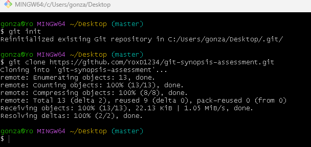

4. Abriendo el IDE y al lado se ve la clonación del repositorio
    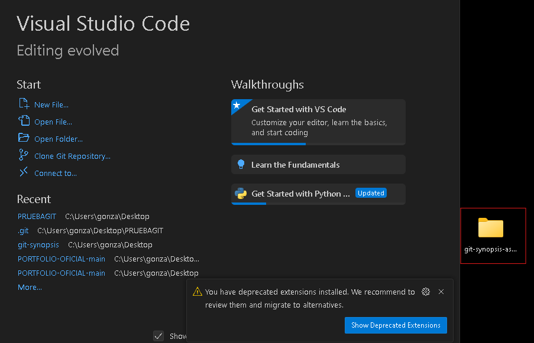

5. Creamos la rama A y nos establecemos en ella con el comando git checkout -b A y verificamos que estemos en la rama A con el comando git branch
    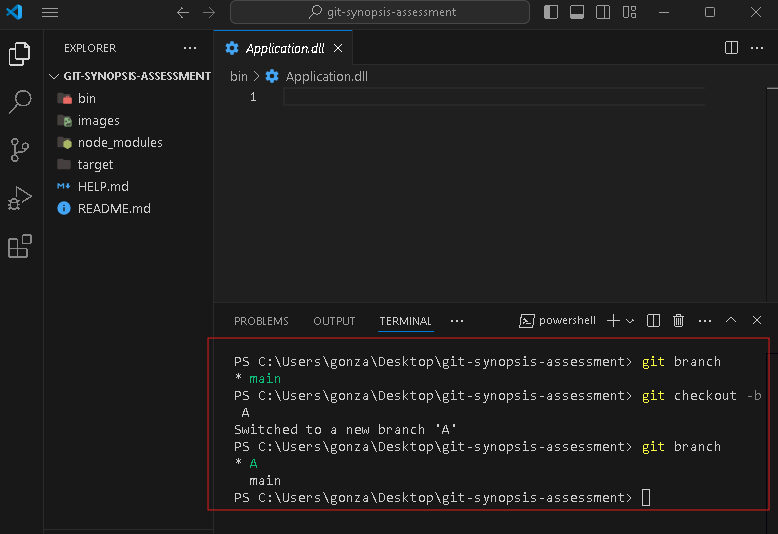

6. Añadimos al gitignore las carpetas solicitadas a restringir en el historial de cambios, las cuales son bin, node_modules y target.
    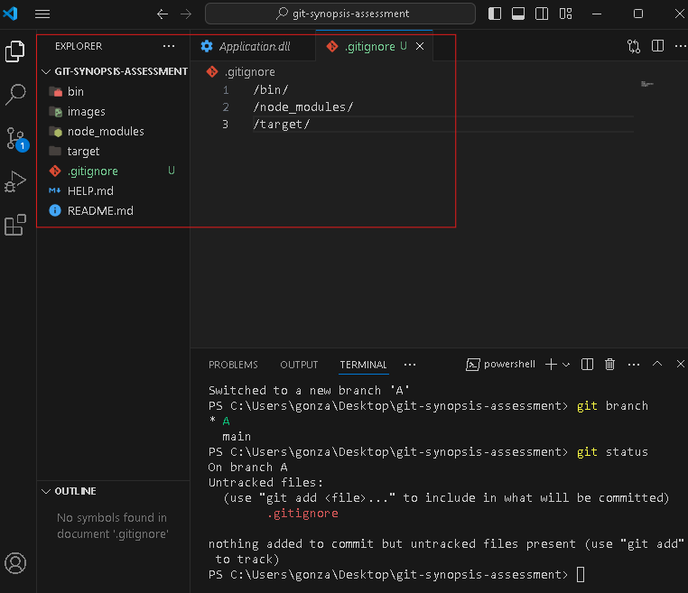

7. Agregamos carpetas con .gitkeep para que a pesar de estar vacias sean incluidas en el historial de cambios al realizar add, commit y push.
    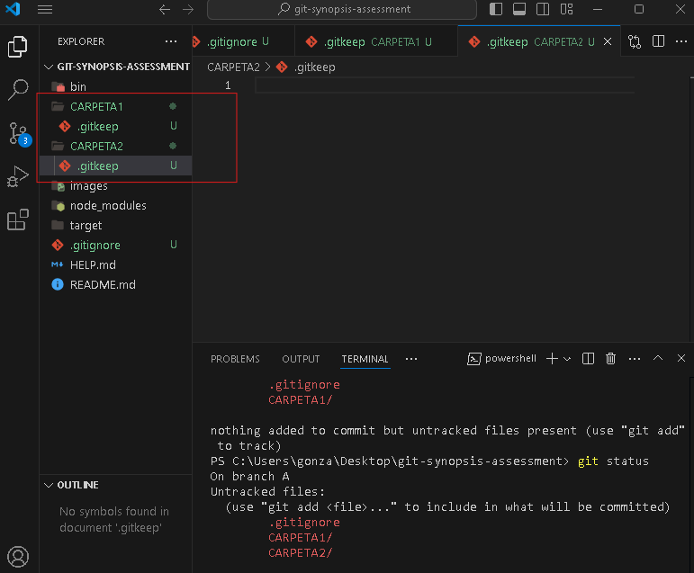

8. Guardamos todos estos cambios realizados en la rama A del fork.
    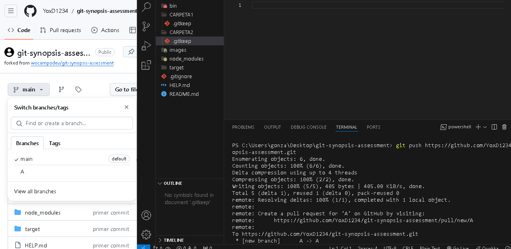

9. Se crea la rama B y nos establecemos en ella con el comando git checkout -b B, verificamos que estemos dentro de B con el comando git branch

    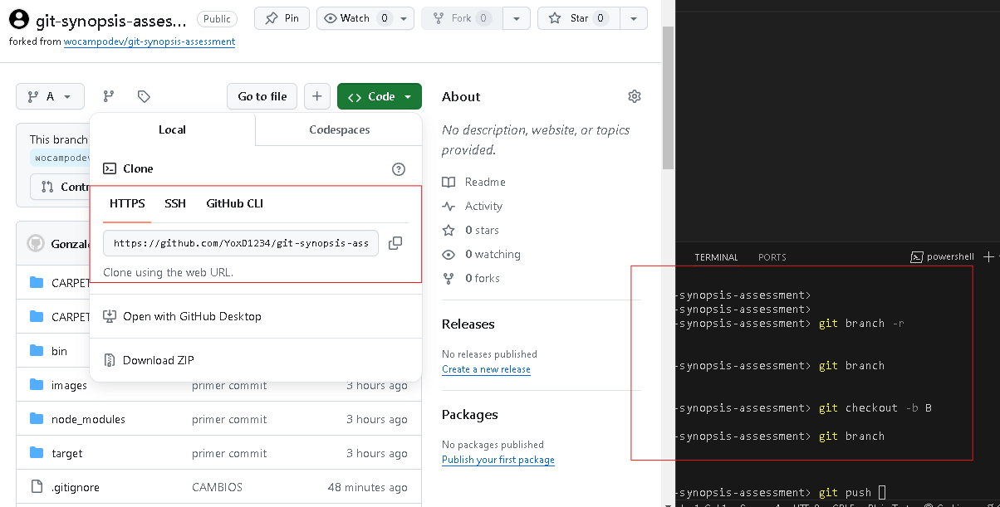

10. Creamos la rama hotfix/main con el comando git checkout -b hotfix/main, realizamos un commit con el mensaje git commit -m "FIX:issue2" y luego un cherry-pick con los primeros 6 caracteres de commit, ya que solo queremos guardar los cambios de ese commit en la rama A, esto se realizará con el comando (estando en la rama a la cual haremos el commit) git cherry-pick c9271
    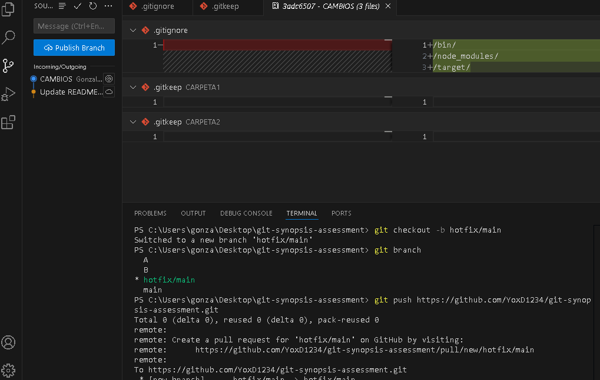
    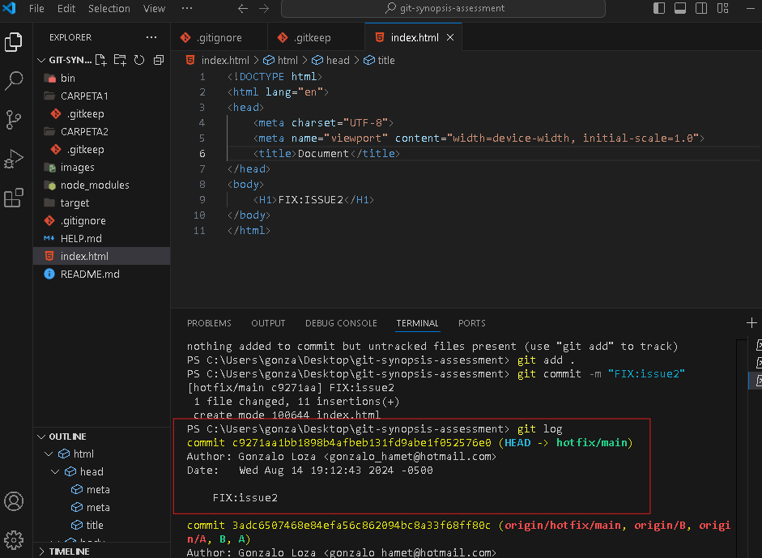
    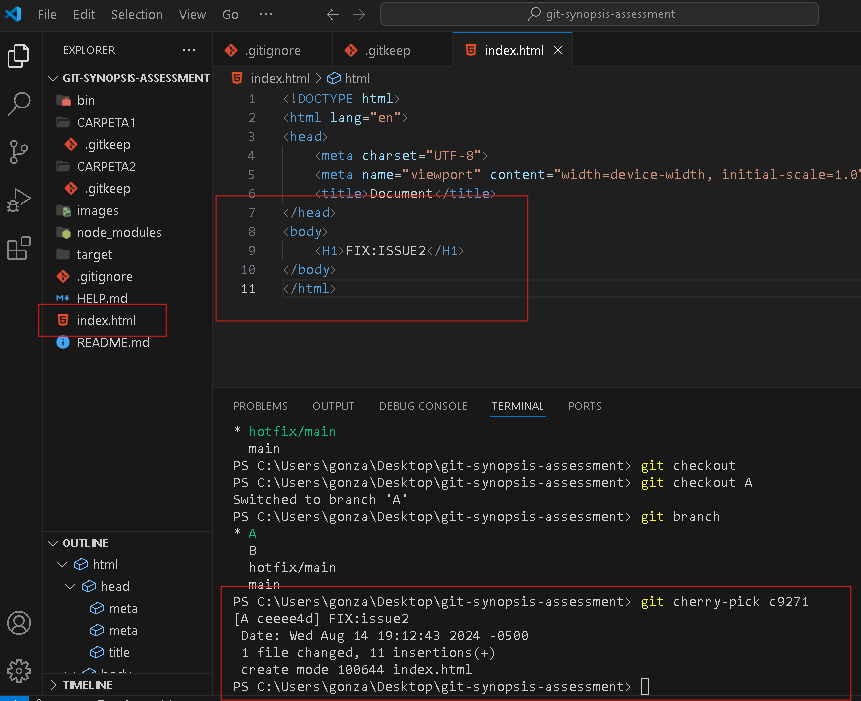

11. Se realiza un git stash para guardar git add ., tendremos una carpeta-stash como evidencia, el cambio de esta será guardado en git stash, el cual luego de cambiar de rama podremos solicitar con git stash apply para posteriormente realizar el commit en la rama que deseemos. A y B
    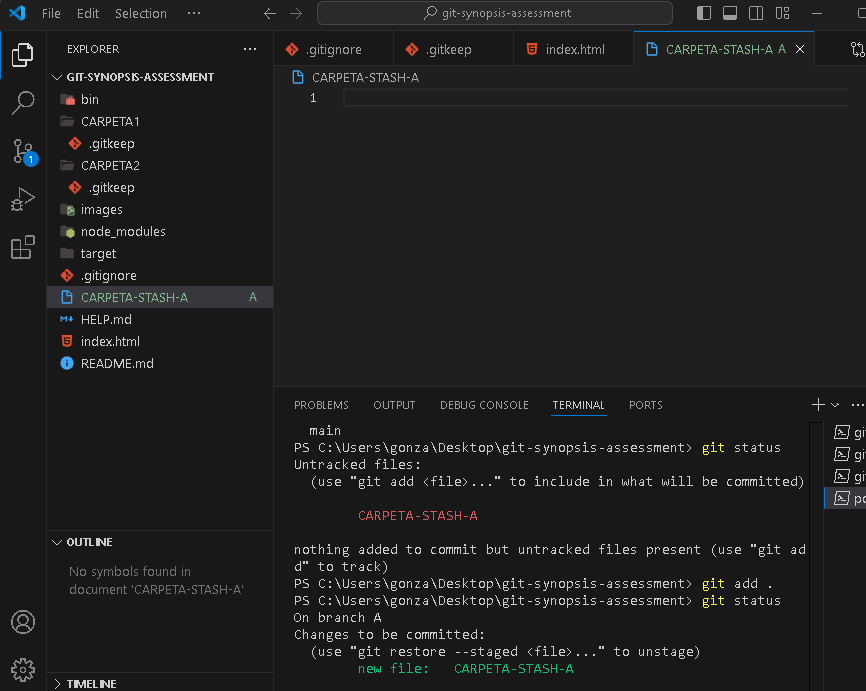
    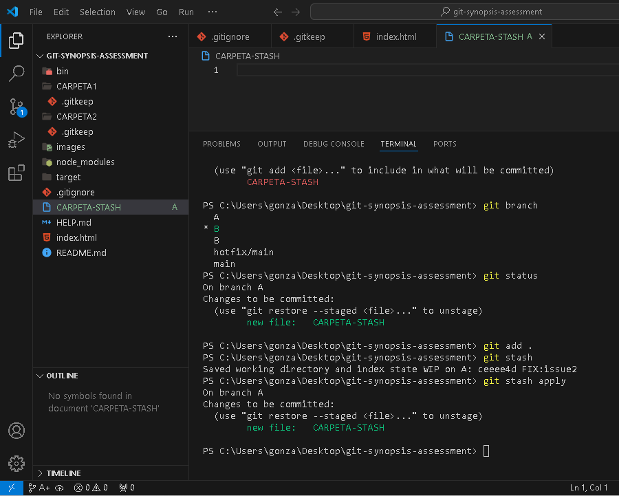

12. realizamos una instancia git tag para guardar la version del proyecto con el comando git tag -a v1.0.0.0 -m "mi primera version", posteriormente veriicamos la version que estamos trabajando con git tag, y posteriormente actualizamos en remoto con git push origin --tags.

    
    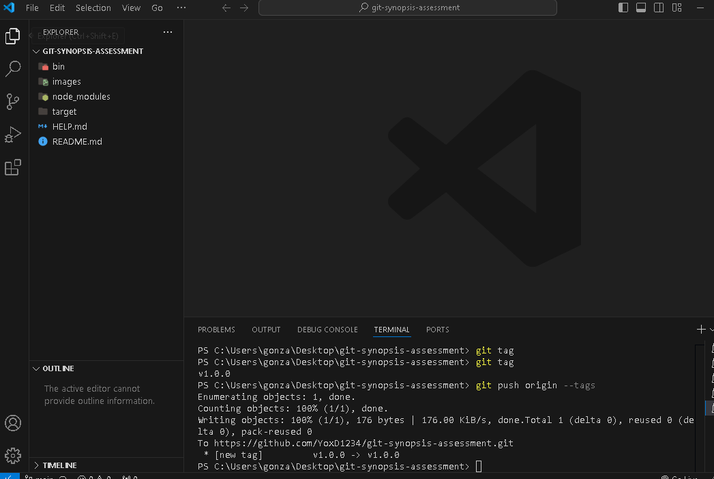

## EXTRAS

1. ACTIVIDAD 1Para regresar al estado anterior despues de aver dado git add . reset.js en mi caso un archivo reset.js que añadi, se utiliza el comando git reset reset.js(nombre del archivo), en donde se volverá al estado anterior a aver guardado en stage el archivo seleccionado.

2. Para regresar en el tiempo hacia un commit anterior en la rama A de su propio repositorio remoto debo establecerme en la rama A con git checkout y buscar git log para ver los cambios realizados, a los cuales podré volver utilizando su codigo hash en el comando git 

    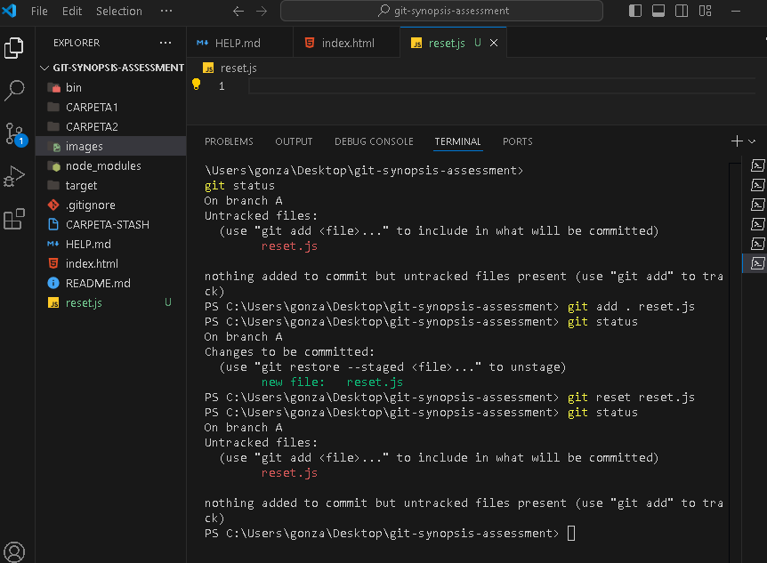

    ...
