# Solución

## Actividad 1

1. EL primer paso a realizar fue clonar el repositorio remoto a mi repositorio local:
    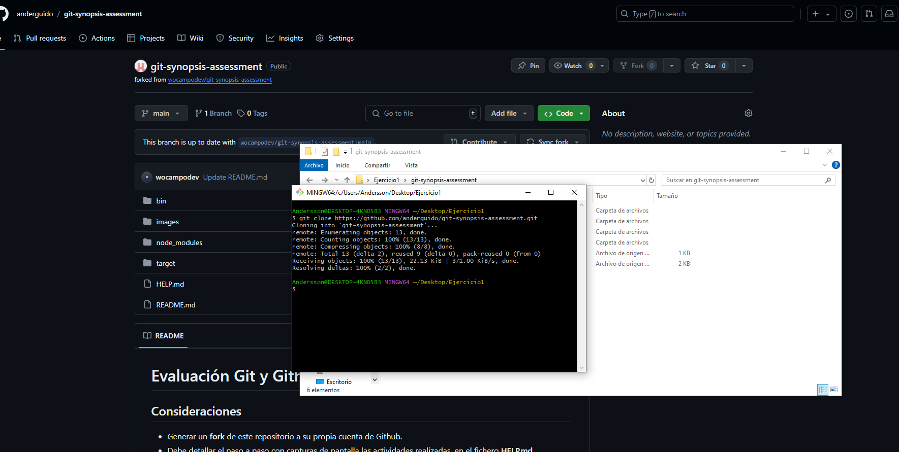

2. Luego cree la Rama "a" y el main.js, que estará dentro de la rama misma rama:

    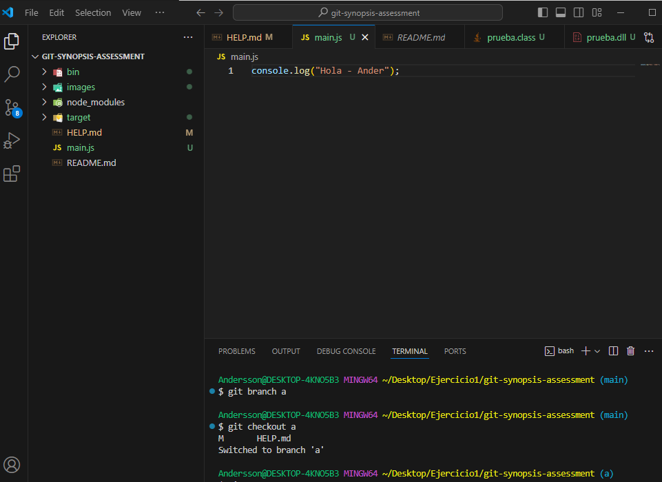

3. Por ultimo realice el commit y push para enviar la captura del main.js al repositorio remoto:

    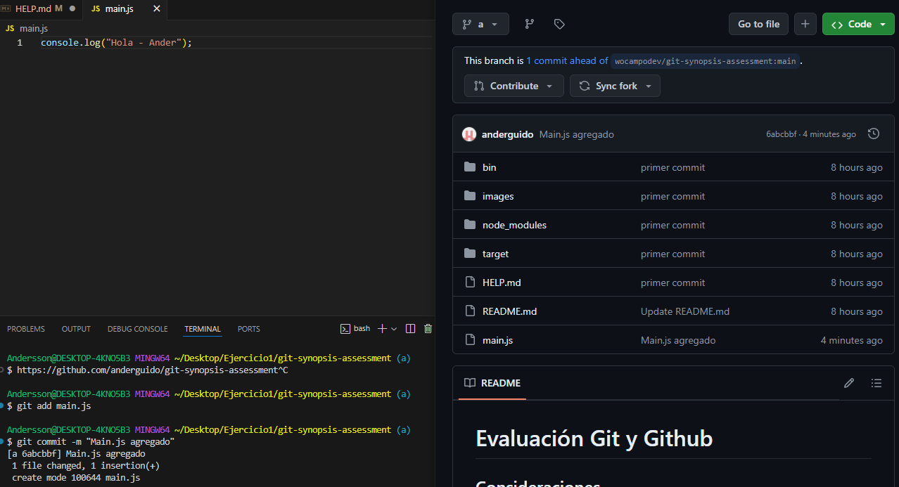

## Actividad 2

1. En primer lugar agregue el ".gitignore", el cual es utilizado para restringir del historial de cambios:
    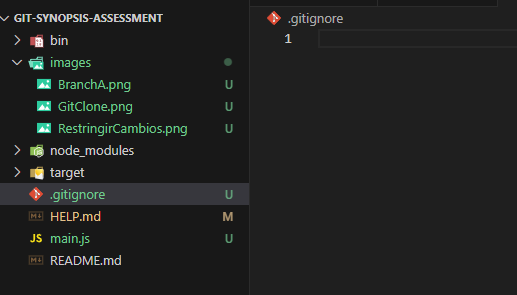

2. Luego, defini que carpetas seran ignoradas del historial de cambios, estas son las carpetas "bin", "node_modules" y "target"
    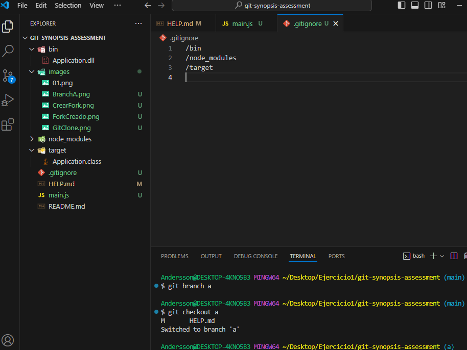

## Actividad 3

1. En este caso, se genero las carpetas "Carpeta1" y "Carpeta2", las cuales no tienen ningun contenido.
    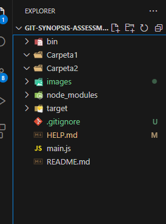

2. Para que ambas carpetas vacias puedan ser incluidas dentro del historial de cambias es necesario aplicar el .gitkeep, en estas carpetas, para que puedan ser trackeadas:
    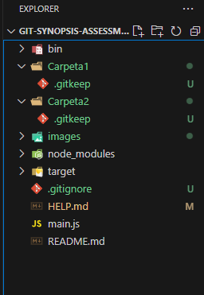

## Actividad 4

1. Se genero la rama "b", y la seleccionamos.
    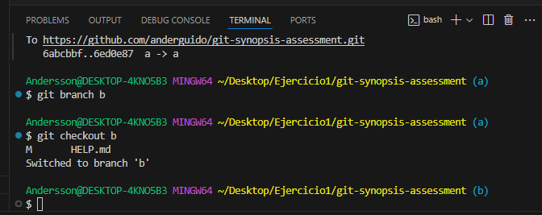

2. La nueva modificación dentro de esta rama será dentro del "main.js", el cual presenta un console.log extra a diferencia de la rama "a":
    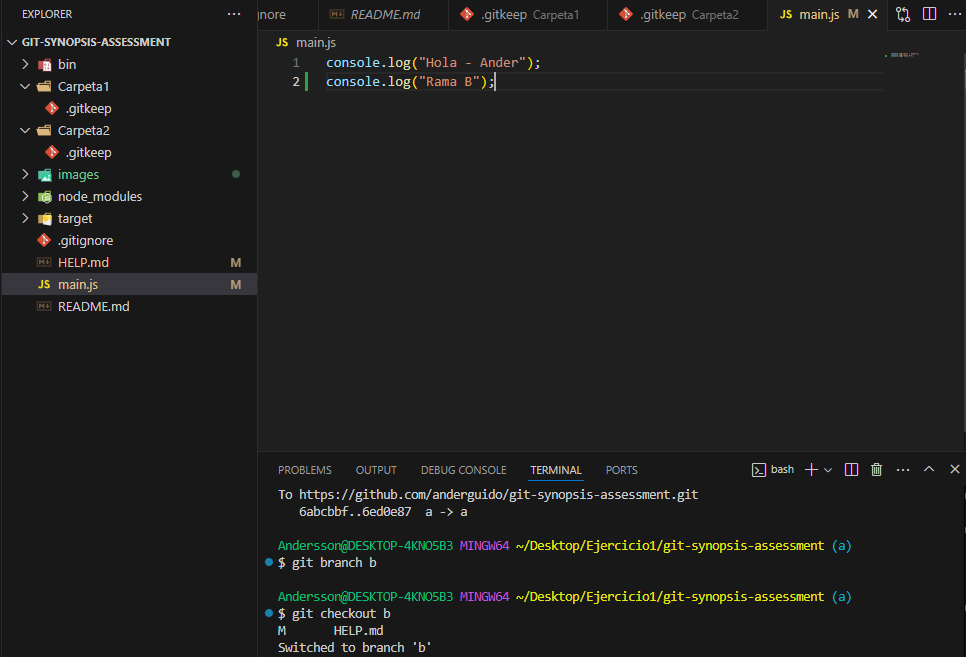

3. Se realizo el commit de la nueva modificación del "main.js" para poder pasarnos otra vez a la rama "a" para realizar la integración:
    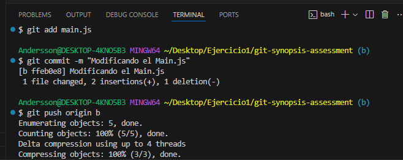

4. Una vez dentro de la rama "a" se realiza el merge con la rama "b", el cual permite agregar las nuevas modificaciones realizadas en la rama "b" a la rama "a":
    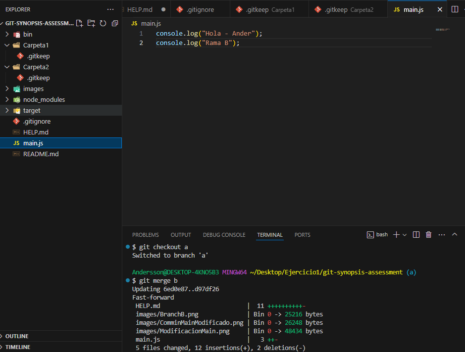

## Actividad 5

1. Se genero la rama "hotfix/main", en la cual realice una modificacion en la "main.js", con el fin de conseugir el log del commit de modificación:
    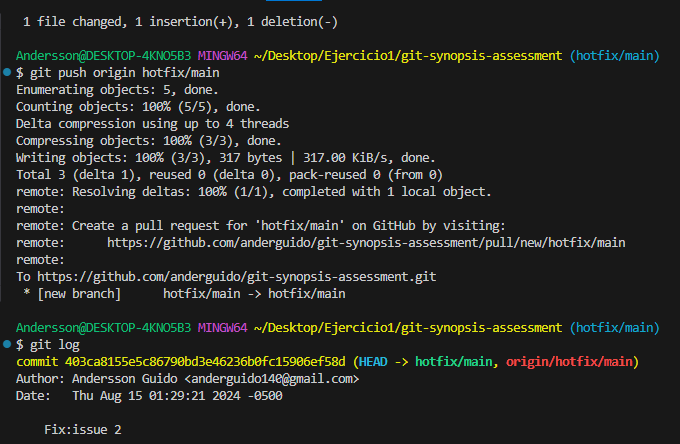

2. Una vez ya obtenido el log del commit del "hotfix/main", me traslade a la rama "a", realizando el cherry-pick con la finalidad de integrar solamente el commit del hotfix a mi rama "a":
    