# Assestement 1 solved  GIT & GITHUB

## Actividades Principales
 
 1. Genere una nueva rama A en base a main y agregar los ficheros que considere necesarios. (.js | .ts | .java | .cs | .html | etc).
 - Fork del proyecto
 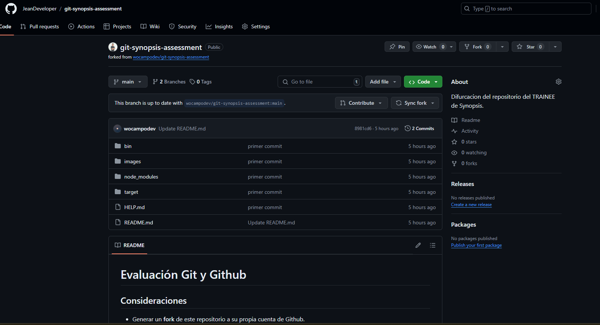
 - Se crearon las ramas en remoto y en local.
 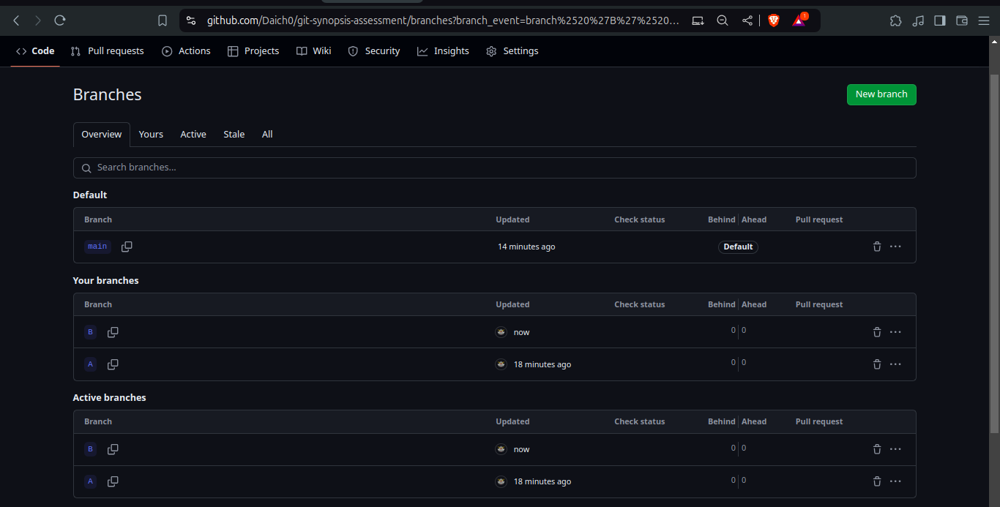
 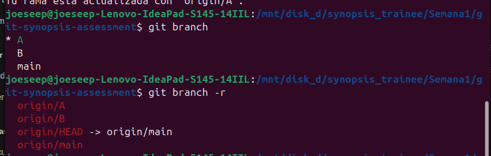
 - Se crearon 2 archivos me.txt e index.js
 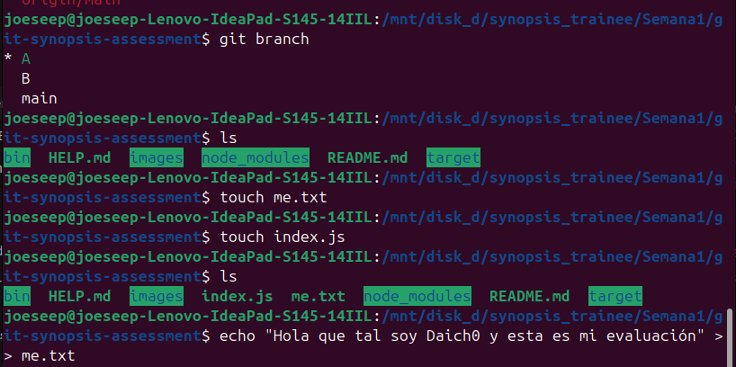
2. Restringir del historial de cambios a las carpetas /bin /node_modules y /target.
 

- Esto se realiza creando el .gitignore e incluyendo los directorios que no se desean usar.Cabe resaltar que en el repositorio se aprecian esos direcotiros pero es xq previamente se habian incluido y esto se evidencia en el commit en el cual fueron creados.
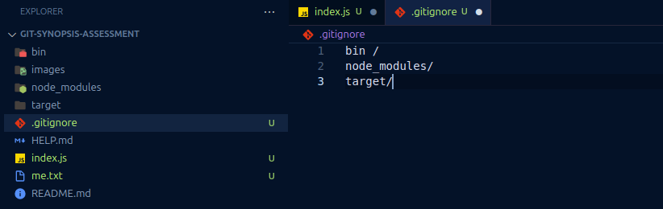

3. Generar 2 carpetas cualquiera sin contenido que sean incluidas en el historial de cambios.

- Git por defecto trabaja en base a ficheros o archivos y no en directorios, por lo que para realizar esto se incluye el archivo ".gitkeep" los cuales se usan por convencion para este tipo de casos,Y aque Git no registra directioris sin archivos.
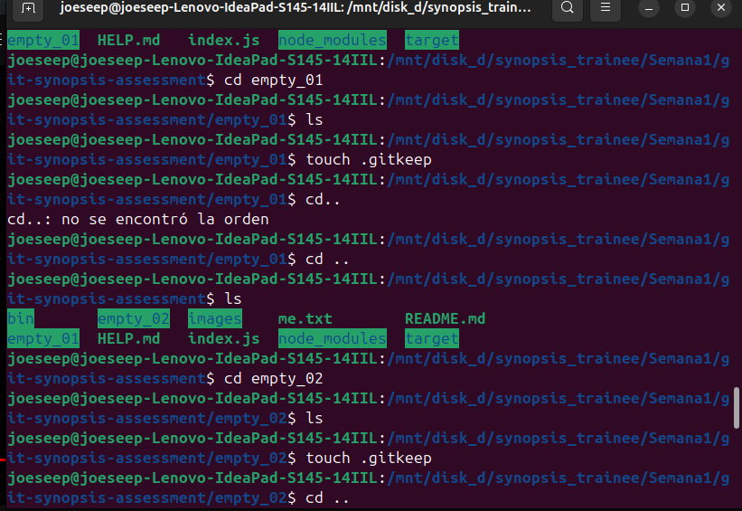
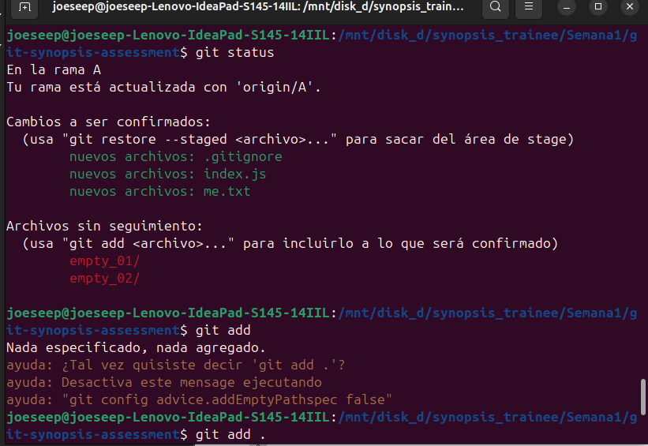

4. Generar otra rama B para realizar nuevas modificaciones y luego integrar estos en la rama A.

- Se creo la nueva rama B con los archivos meB.txt e index.html ,posteiormente se realizo un merge de estos en A
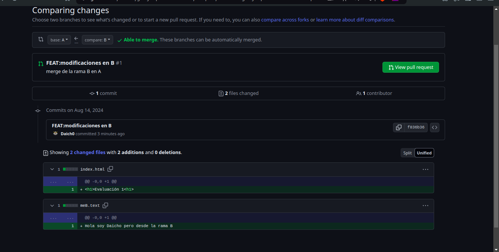

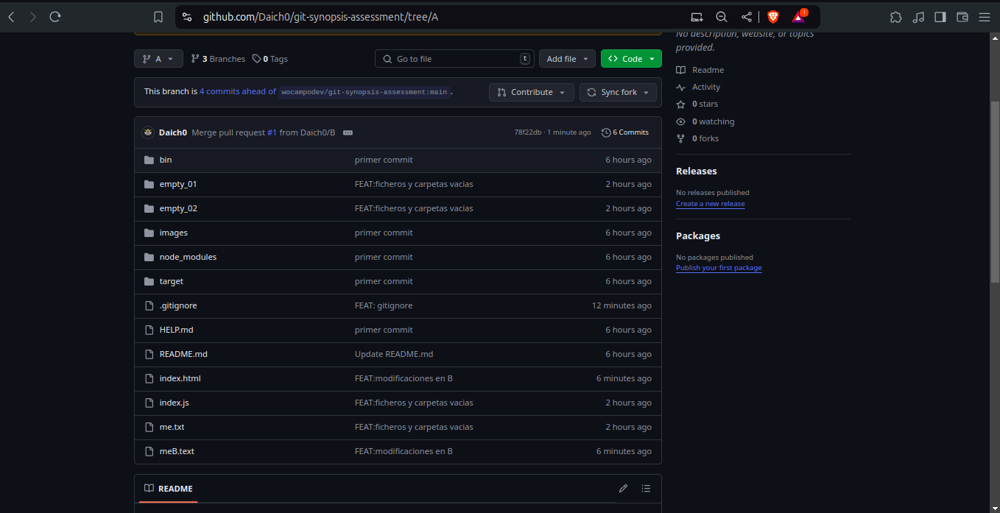

5. Integrar SOLO el commit con nombre "FIX: issue 2" de la rama hotfix/main en la rama A.
-   Esto se realizo con el comando  git cherry - pick , el cual permite usar commits especificos de una rama para poder mergearla en otra.
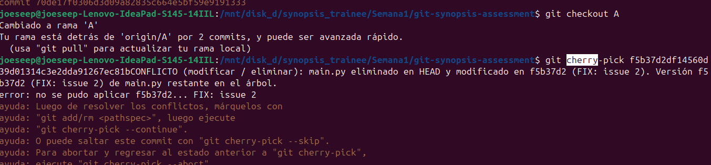
- El error eviedncia un falta de pull en la rama , se solciuioncon y se evidencia en la siguiente imagen el exitoso merge del 2do commit de hotfix/main.
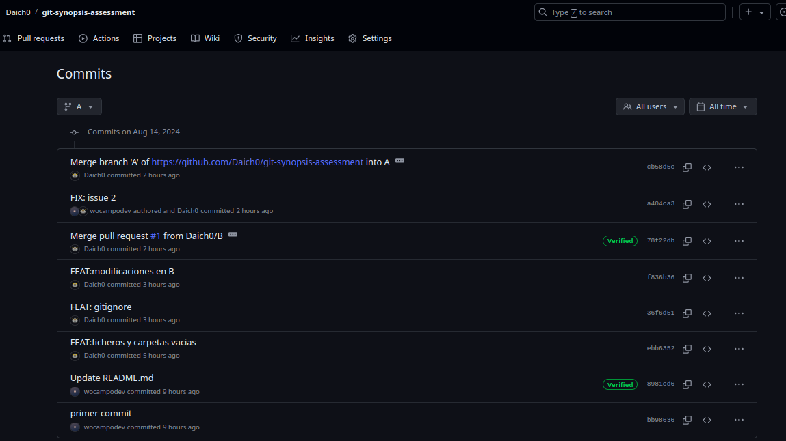

6. Ejemplifique el uso de git para la modificación de ficheros en la rama A y en la rama B simultaneamente sin generar commits en el historial de cambios.
- Para esto usamos el comando "git stash" en el cual no guardamos commit y tenemos lo cambios guardados temporalmente.Pirmero se modificado los archivos y se les asigna un stash , luego se comprueba como estan despues de cambiar de rama y al ejecutar el comando "git stash pop" observamos como vuelve el cambio
-Para la rama A
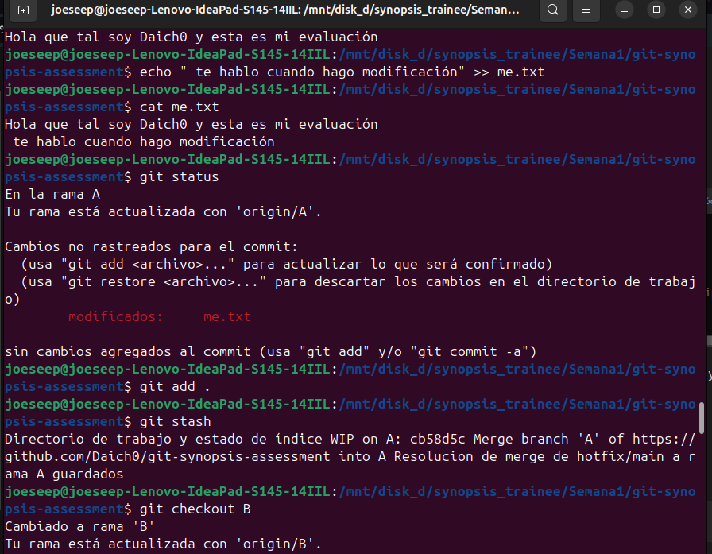
/
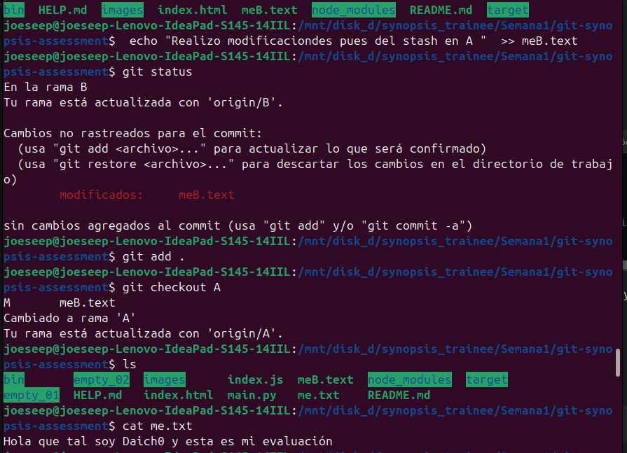
/
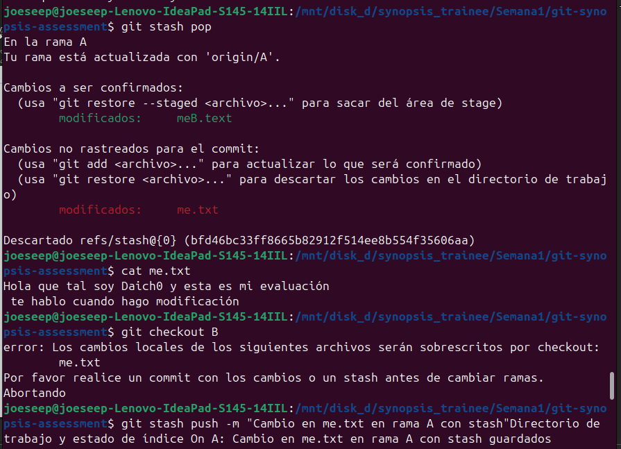
- Para la rama B
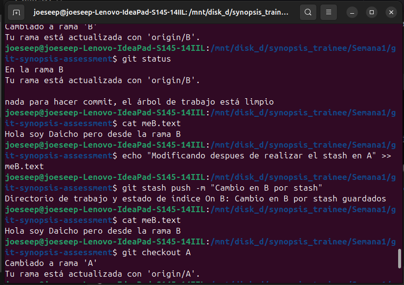
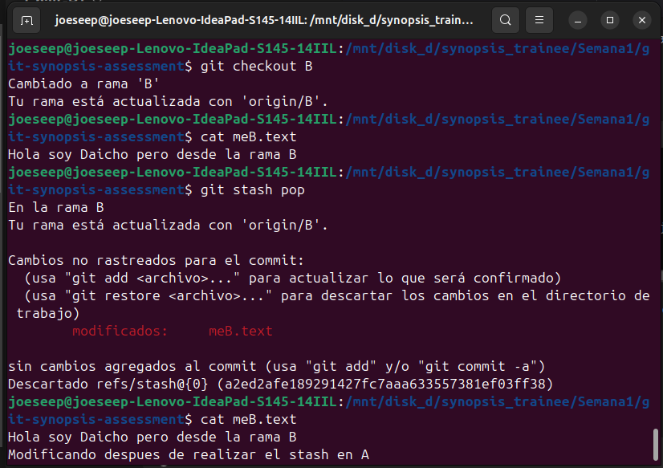
7. Ejemplifique el uso de git para la generación y publicación de un nuevo release (versión) de su código
- Esto se realiza con git tag, y nos permite ver la version de del proyecto que realizamos, es esencial cuando tenemos CI/CD y automatizacion en devops.
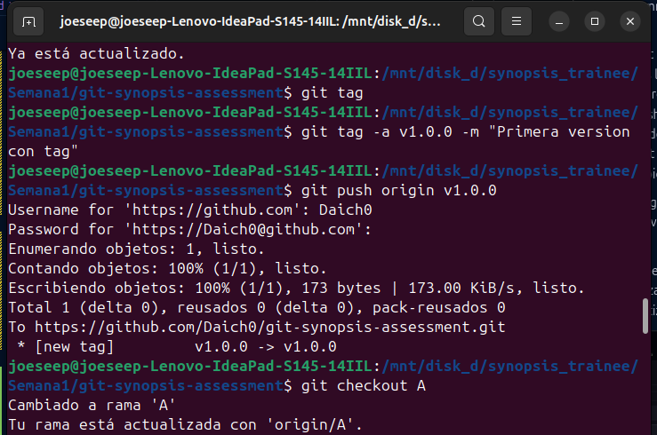
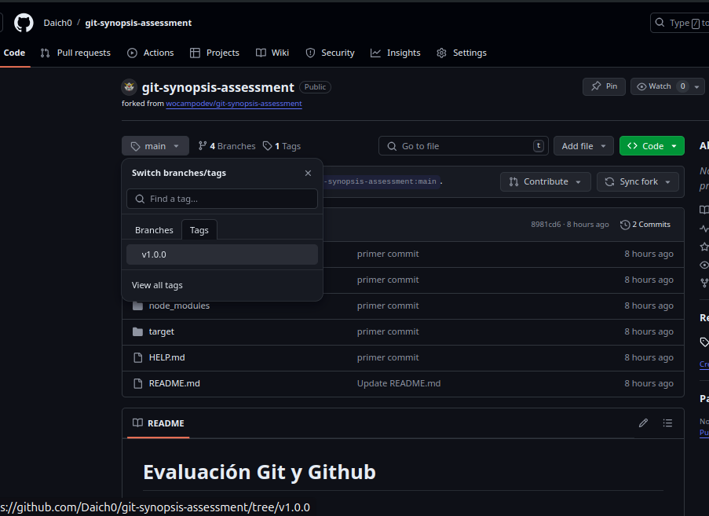
## Actividades Extras
1. Ejemplique el uso de git para devolver un fichero del staging area al estado anterior.
- Para este caso se usa el comando git restore , primeramente con --staged para llevar del stagging area al working directory , y posteiormente sin --staged parra llevarlo al ulitmo commit .Se ejemplifica con el archivo main.py.
  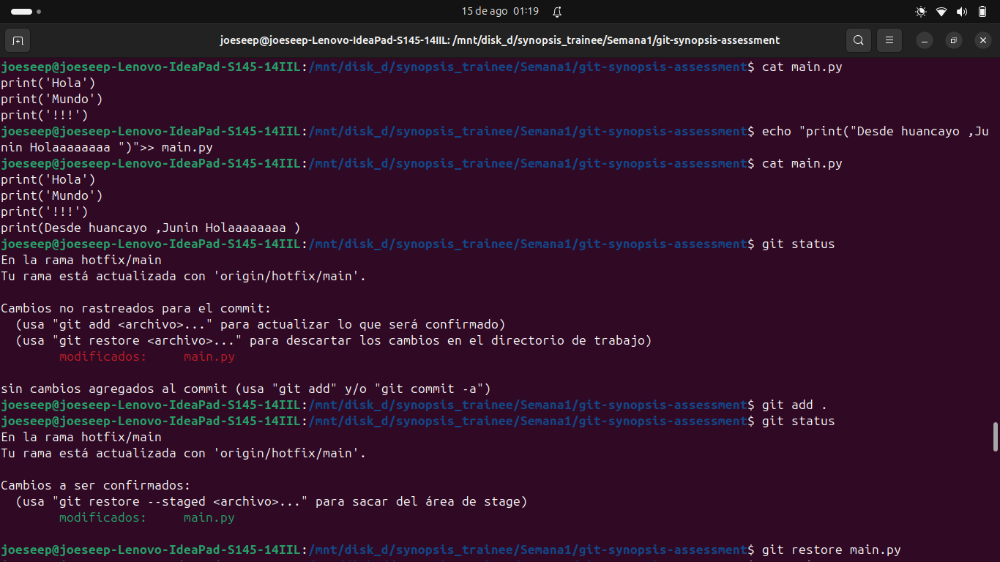
  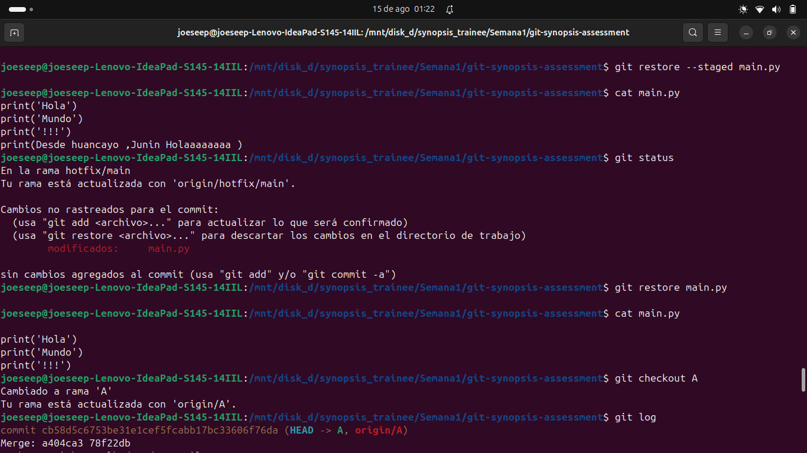
2. Ejemplifique el uso de git para regresar en el tiempo hacia un commit anterior en la rama A de su repositorio remoto propio.
- Para esto usaremos lo ids de los commit, git reset y git log para saltar a travez del tiempo , en est caso se usa ---hard para notar la diferencia en el working directory
 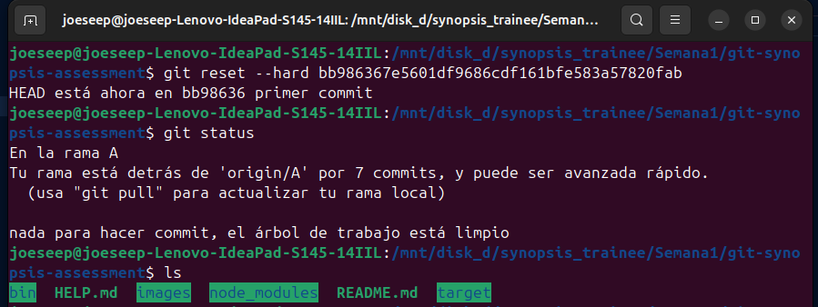
 - Se evidencia la diferncia al listar ambos directorios , que son el mismo peor en diferentes commits, cuando desaparecen en el primer commit.
 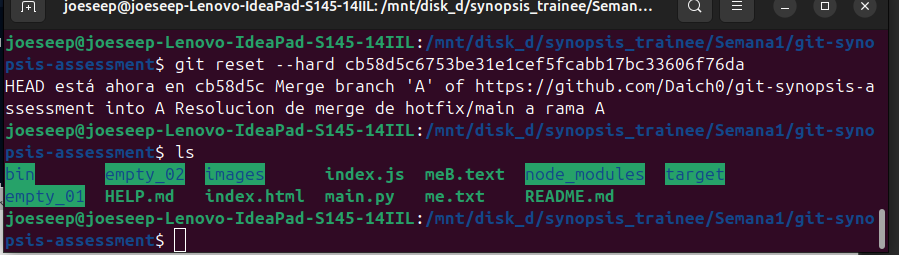