# Solución de la evaluacion de Git

## Consideraciones

1. Generar un fork de este repositorio a su propia cuenta de Github
    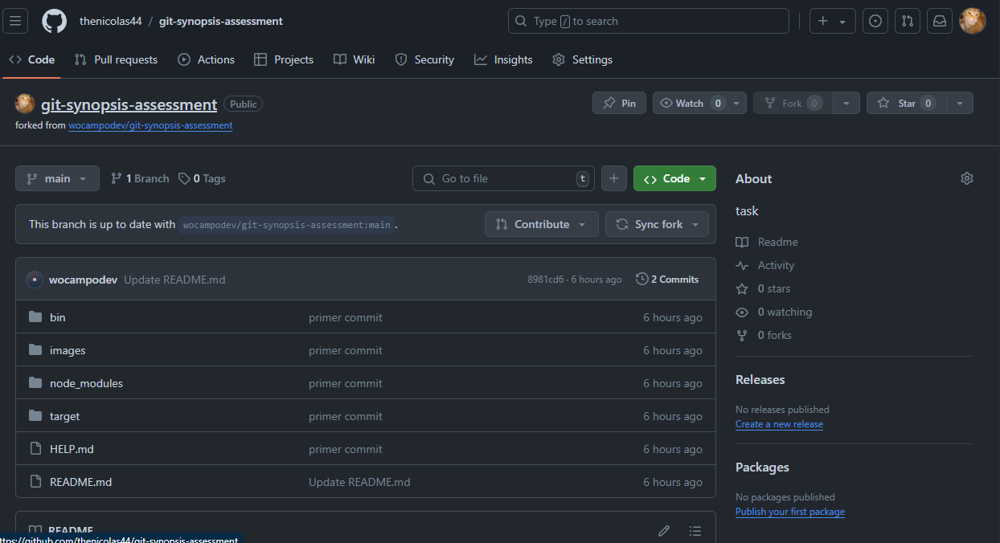

2. Clonarlo a la computadora
    

# ACTIVIDADES PRINCIPALES

## Actividad 1 : Genere una nueva rama A en base a main y agregar los ficheros que considere necesarios. (.js | .ts | .java | .cs | .html | etc).

1. Se genero la nueva rama A en base a la rama main

    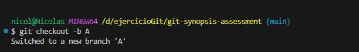

2. Se creo nuevos ficheros dentro de la rama A

    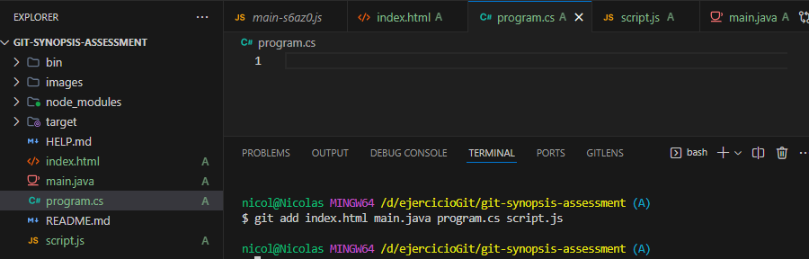

## Actividad 2 : Restringir del historial de cambios a las carpetas /bin /node_modules y /target.

1. Se creo el archivo .gitignore para poder restringir las carpetas del historial de cambios

    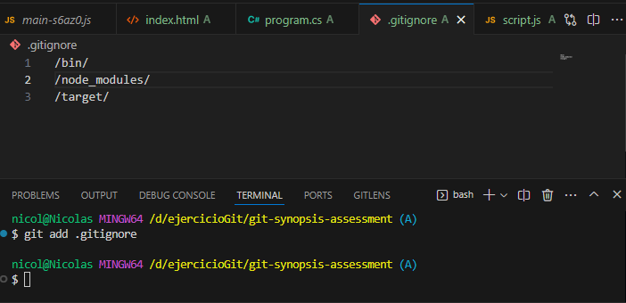

## Actividad 3 : Generar 2 carpetas cualquiera sin contenido que sean incluidas en el historial de cambios.

1. Se crearon 2 carpetas de nombre "carpeta01" y "carpeta02" y se agrega el archivo .gitkeep para que se tome en cuenta esas carpetas en el historal de cambios

    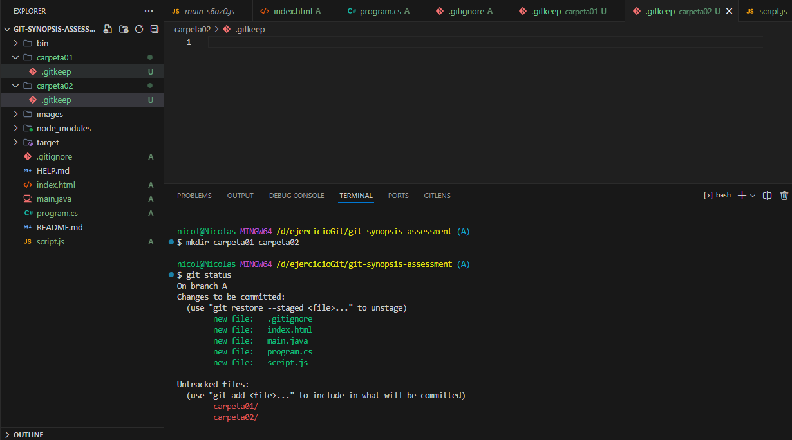

## Actividad 4 : Generar otra rama B para realizar nuevas modificaciones y luego integrar estos en la rama A.

1. Se creo la rama B 

    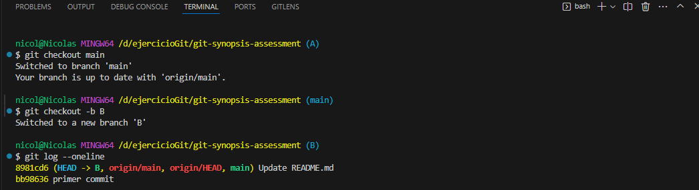

2. Se hacen modificaciones a la rama B y se genera un commit

    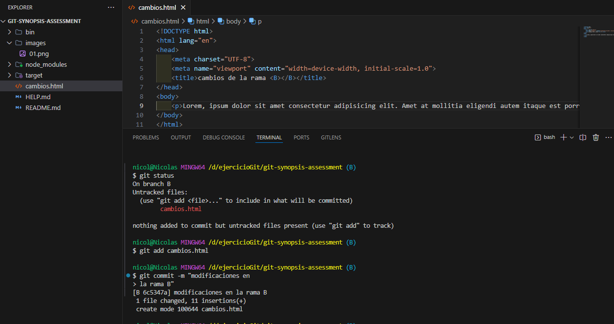

3.  Se regresa a la rama A para poder implementar los cambios de la rama B mediante "merge"

    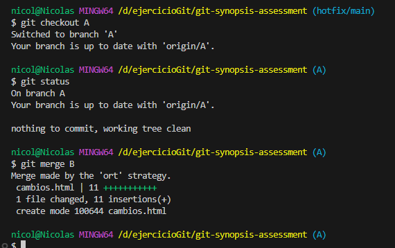

4. Finalemente se visualiza el merge realizado en la rama A

    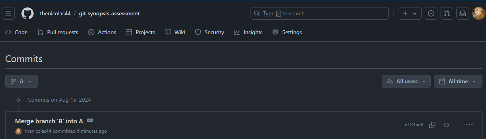

## Actividad 5 : Integrar SOLO el commit con nombre "FIX: issue 2" de la rama hotfix/main en la rama A.

1. Se realiza un git log para observar los commits realizados en esa rama  y se escoge el id del commit con nombre "FIX: issue 2"

    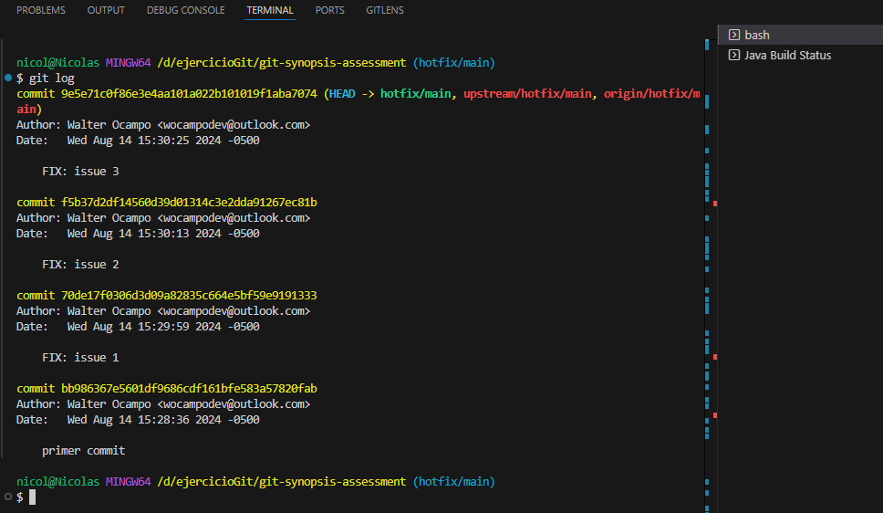

2. Se usa el cherry-pick para integrar solo ese commit en la rama A

    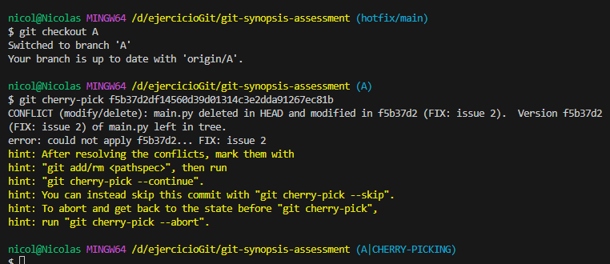

3. Debido a un conflicto de integracion se añade el archivo main.py a staged y finalmente se integra ese commit a la rama A

    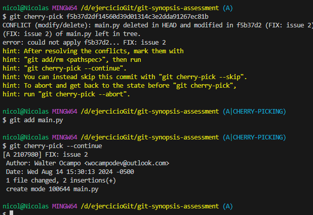

## Actividad 6 : Ejemplifique el uso de git para la modificación de ficheros en la rama A y en la rama B simultaneamente sin generar commits en el historial de cambios.

1. Se modifican los archivos de la rama A (simulando un trabajo)

    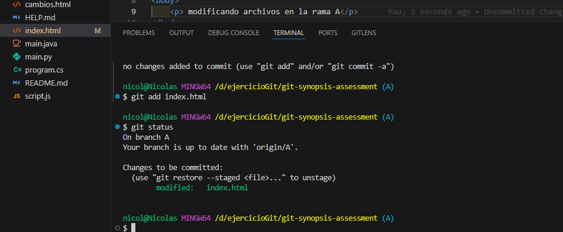

2. Se usa el stash para poder moverse a otra rama sin realizar ningun commit

    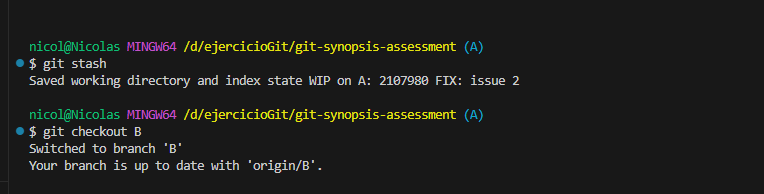

3. Se cambia hacia la rama B para modificar sus archivos y aplicamos stash para regresar a la rama A

    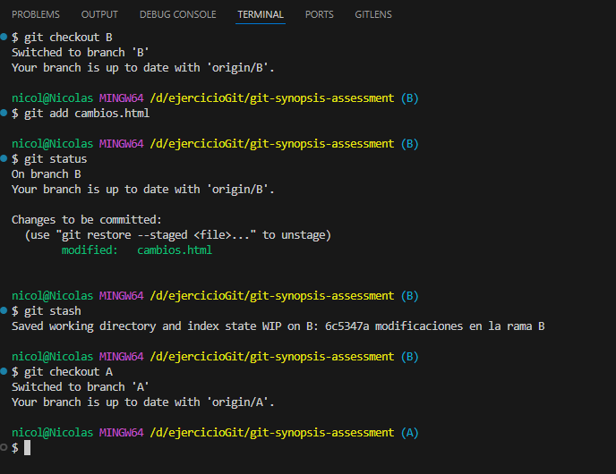

4. Se retorna a la rama A y se usa git stash list para visualizar la lista de archivos modificados que no estan en un commit

    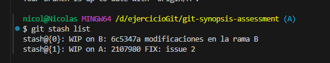

5. Se retorna el archivo en staged al work directory mediante  git stash pop 

    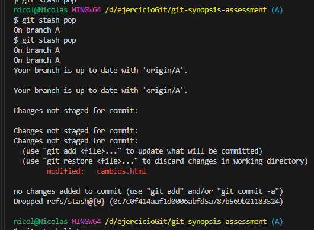

## Actividad 7 : Ejemplifique el uso de git para la generación y publicación de un nuevo relase (versión) de su código.

1. Para la generacion y publicacion de un release se necesita un tag
    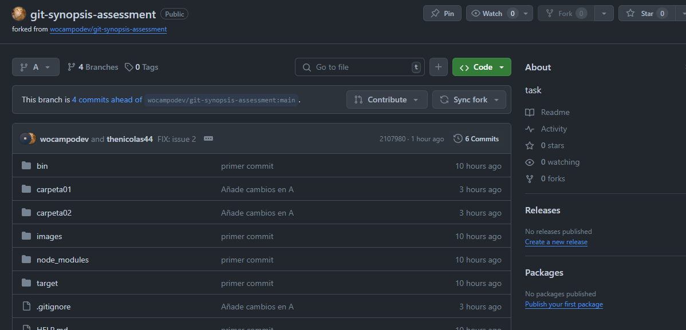

2. Se crea un tag 

    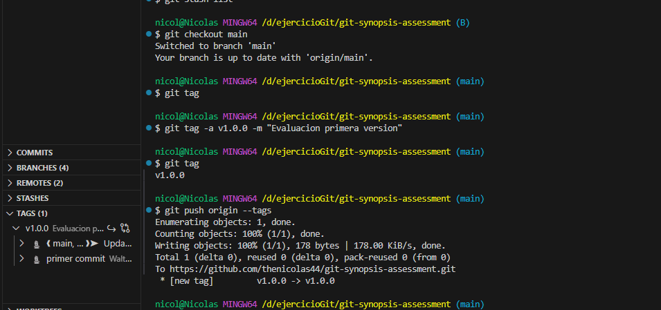

3. Se usa el tag para la creacion del release 

    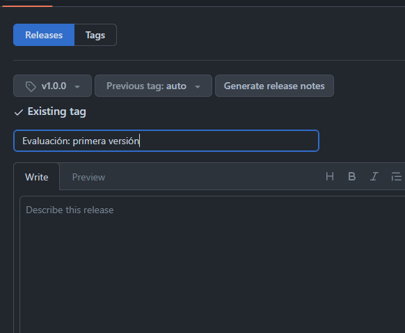

4. Finalmente se muestra el release publicado

    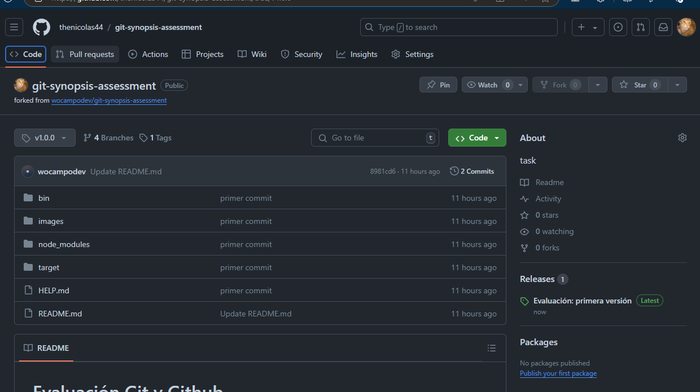

# EXTRAS

# Extra 01: Ejemplique el uso de git para devolver un fichero del staging area al estado anterior.

1. Se ubica en la rama B para la modificacion de un archivo 

    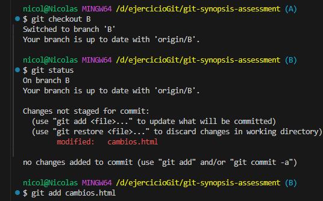

2. Se coloca el archivo modificado en el staging area

    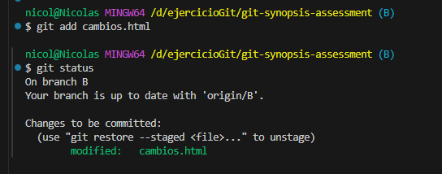

3. Se devuelve el archivo del staging area a un estado anterior

    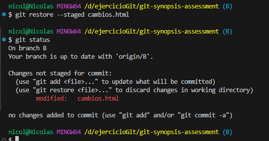

# Extra 02: Ejemplifique el uso de git para regresar en el tiempo hacia un commit anterior en la rama A de su repositorio remoto propio.

1. Se realiza un git log --oneline para ver de forma resumida la lista de commits realizados en la rama A

    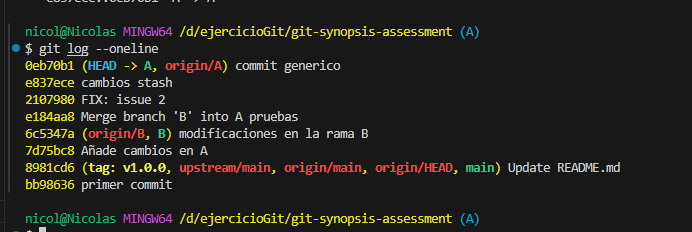

2. Se seleciona el id del commit de nombre "cambios stash"(que es el commit al que se desea regresar) y se realiza el comando git reset --soft para que se mantenga todos los cambios realizados después de ese commit en el staging area

    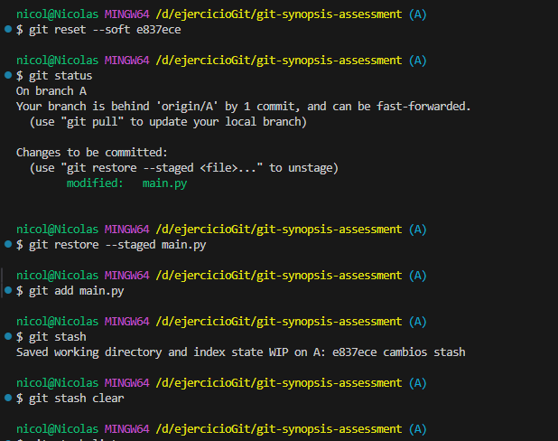
    Como se observa, no se desea conservar el cambio del archivo main.py por lo que lo mandamos a stash y lo eliminamos 

3. Se realiza el commit para restaurar el commit anterior 

    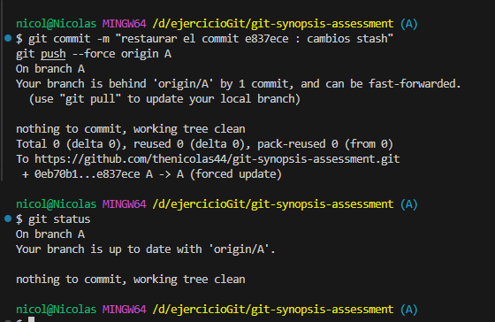

4. Finalemente se observan los cambios realizados
    *Antes
    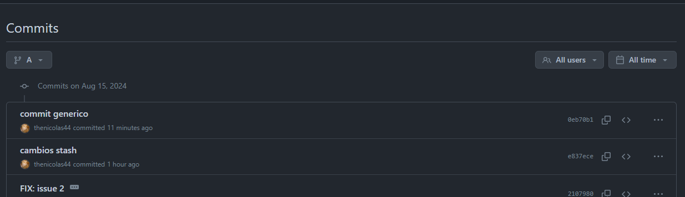
    *Despues
    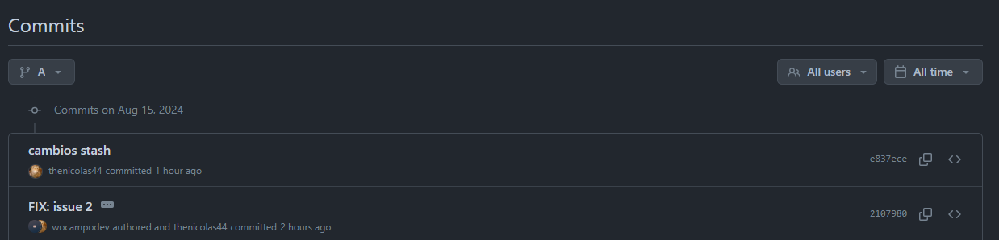

**Investigar sobre git reset**
    El git reset es un comando de git que dependiendo de su uso puede afectar el historial de commits, el staging area, y el working directory.

    Tipos de git rest:
* git reset --soft <commit> :mantiene todos los cambios realizados después de ese commit en staging
* git reset --mixed <commit> : deja todos los cambios realizados después de ese commit en el working directory
* git reset --hard <commit> : borra todos los cambios realizados después de ese commit