# Solución - Arnold Balabarca

## Actividades principales

### Fork del repositorio

1. hice fork al respositorio principal mediante la opción de GitHub
   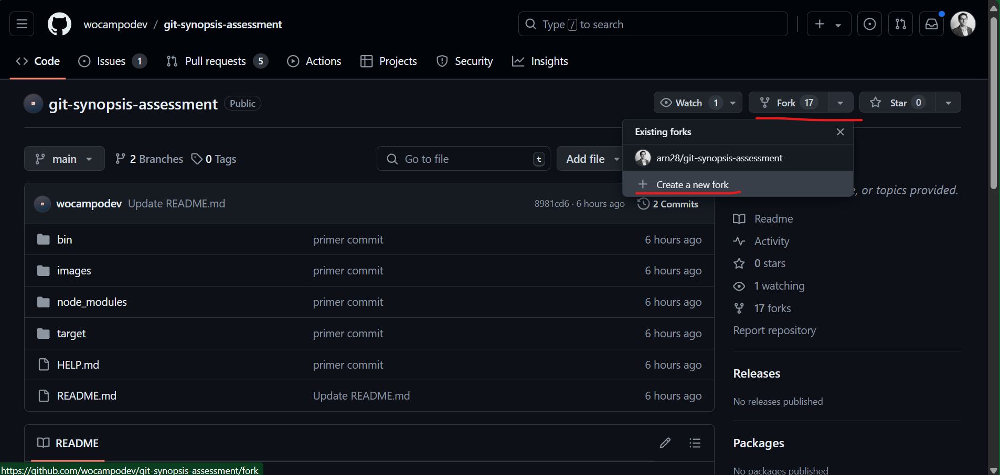

2. Cloné el repositorio para su modificación
   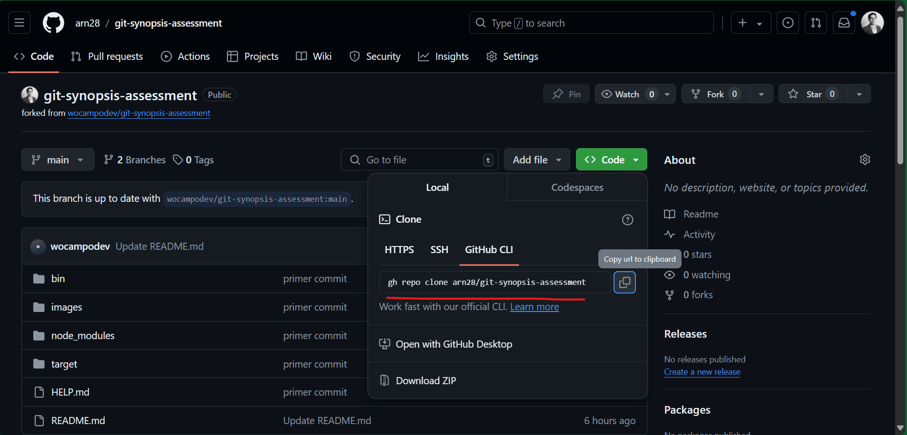

_Nota: Utilicé git alias: git co (git checkout), git cim (git commit -m), etc_

### Actividad 1 - Creación de rama

1. Creé una rama nueva a partir de la rama `main` llamada `feature/brach-a`

   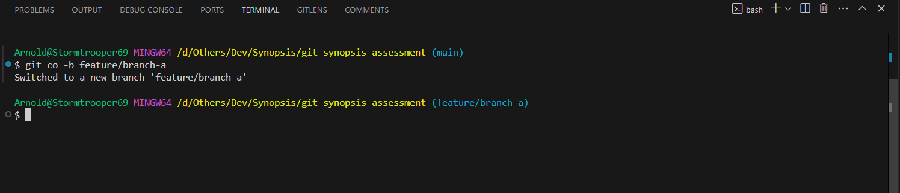

2. Cree archivos html, css y js, por ejemplo una pagina de home. Luego agregé todos los archivos usando la terminal, para luego hacer push al repositorio remoto

   _comandos git_:

   ```
   git add .
   git commit -m "mensage de commit"
   git push
   ```

   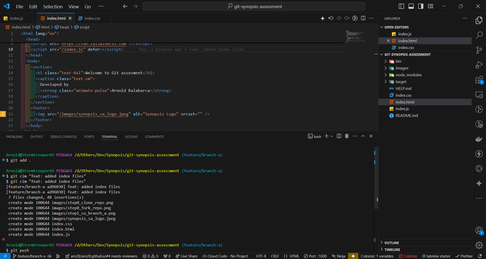

### Actividad 2 - Ignorar archivos y/o carpetas

1. Creé en el directorio principal un archivo `.gitignore`

2. Agregué las reglas para ignorar carpetas en el archivo `.gitignore`

   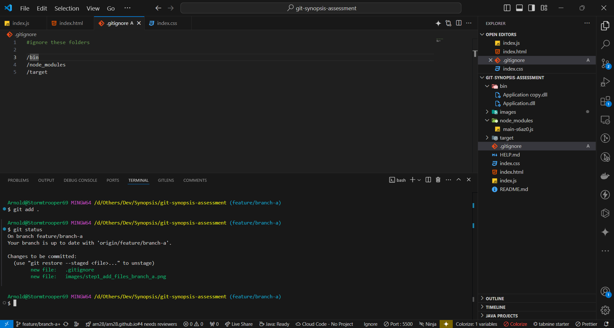

3. Como también se ve en la imagen, se agrego un archivo `Application copy.dll` el cual no es tomado en cuenta por git ya que esta dentro de la carpeta `bin`, la cual esta siendo ignorada

### Actividad 3 - Generar carpetas

1. Creé dos carpetas populares _`pages`_ y _`helpers`_
2. Para que estas carpetas sean agregadas en git, dentro de cada una creé un archivo `.gitkeep`. Y como se ve en la imagen los cambios son agregados en stage para luego hacer commit.
   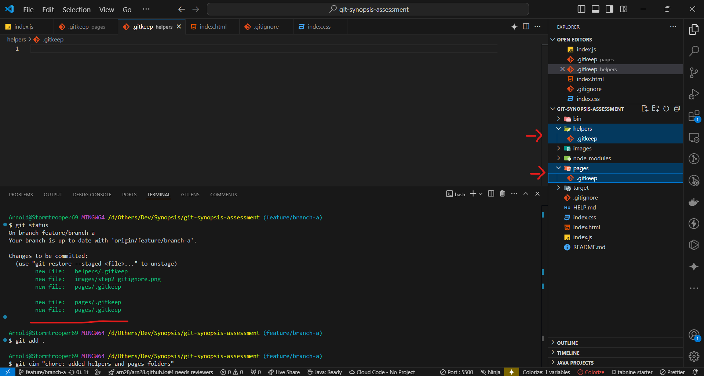

### Actividad 4 - merge

1. Creé una nueva rama `feature/brach-b` a partir de `feature/brach-a`
   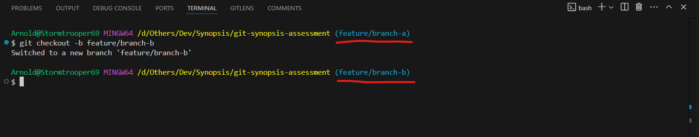

2. Traer los cambios de una rama a otra, también llamada merge, se pueden hacer mediante un **Pull Request** que serian recomendables en caso de un _code review_. En la imagen vemos la comparacion de cambios entre ambas ramas
   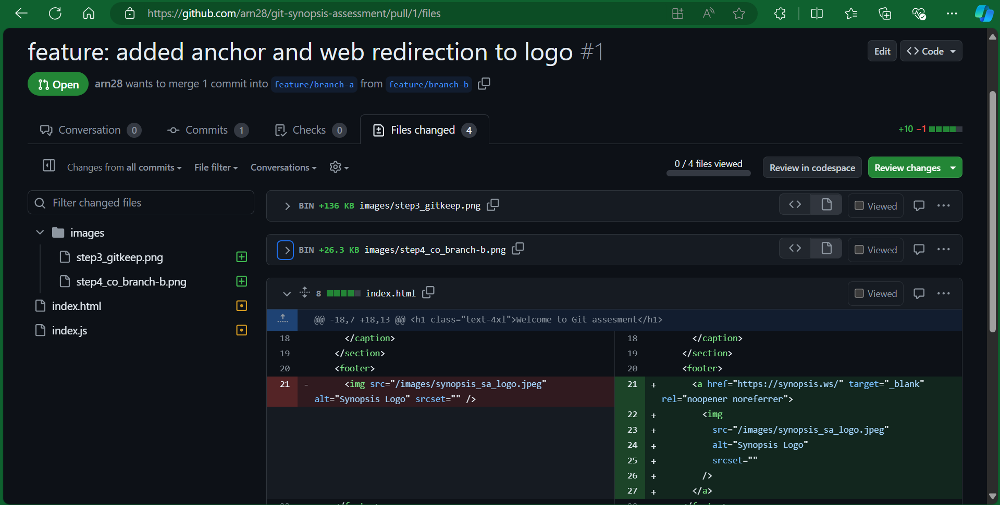

3. En este caso usaremos el comando `git merge`, para lo cual:

   - primero cambié a la rama `feature/branch-b` y nos trajé todos los cambios con `git pull`
   - Luego, cambié a la rama `feature/branch-a` y para traer los cambios de la rama b utilicé `git merge feature/branch-b`

     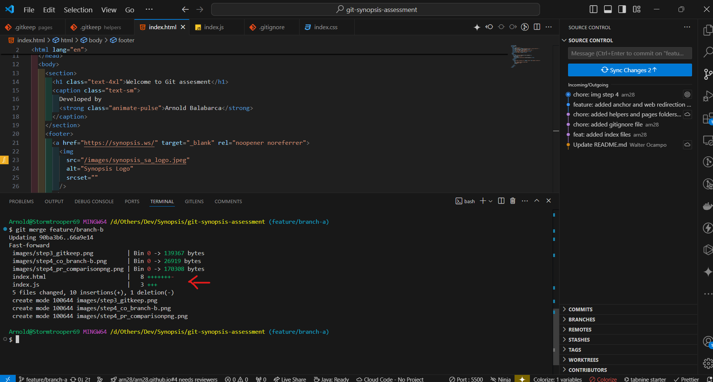

     Como se observa en la imagen me trajó los cambios desde la rama `feature/branch-b` -> `feature/branch-a`

   - Por ultimo se hace `git push` para mandar lo cambios al repositorio remoto

### Actividad 5 - cherry-pick

1. Me coloqué en la rama `hotfix/main` y traje todos los cambios con `git pull`

2. Revisé el historial de commits con `git log` para tener la referencia del que nos interesa, en este caso **"FIX: issue 2"**
   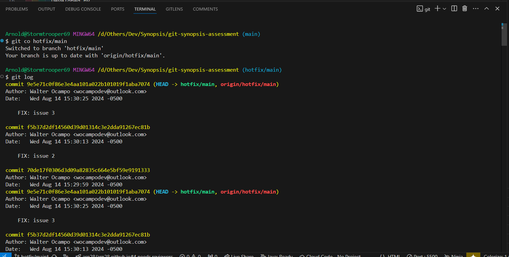
   Para tener la lista de commits más entendible y la referencia de los primeros digitos importantes del commit, podemos usar `git log --oneline` y lo veremos de la siguiente manera
   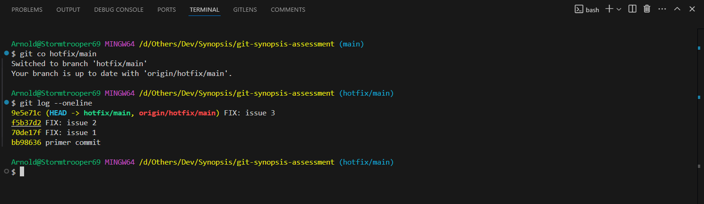
3. Copié la referencia del commit, en este caso `f5b37d2`

4. Me coloqué en la rama donde se aplicara el commit, `feature/branch-a`, y utilice el comando `git cherry-pick f5b37d2`, el cual me trae los cambios del commit en especifico.

   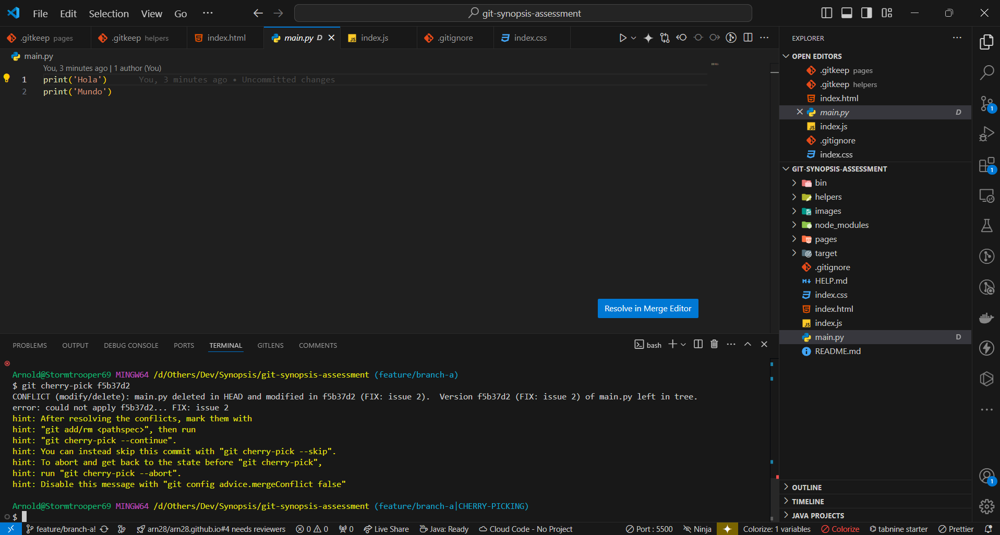

   Como se observa, hay un conflicto al traer los cambios y se debe a que el archivo `main.py` originalmente no existe en la rama actual (_feature/brach-a_), asi que no hay modificaciones que hacer, pero sí trae los cambios.

5. Procedí a manejar el conflicto usando el editor de codigo y marcandolo como resuelto

6. Ya podemos observar los nuevos cambios en el rama `feature/branch-a`

   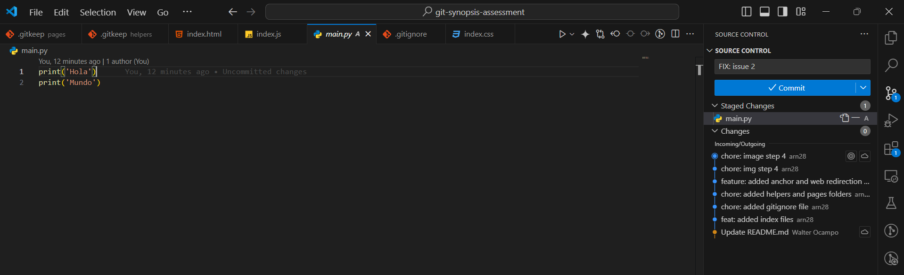

### Actividad 6 - git stash

1. Empecé estando en la rama `feature/branch-a` y realizando cambios, sin generar commits
   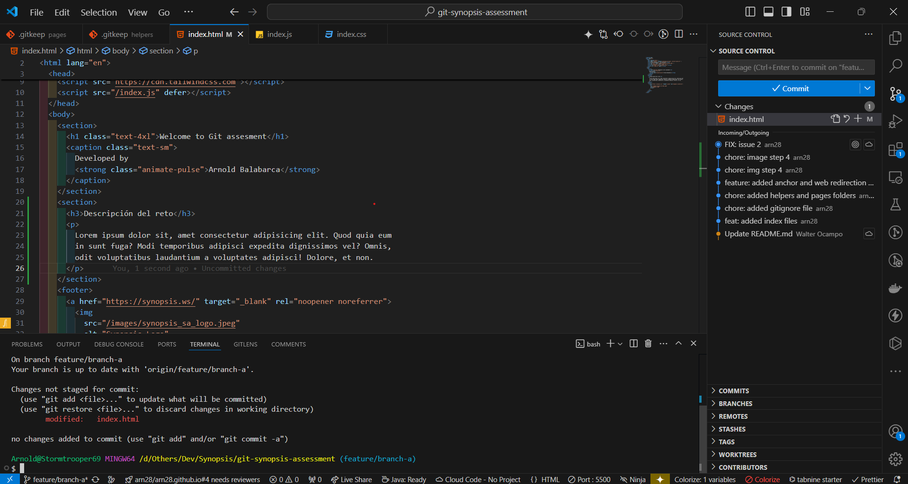

2. Como lo que quiero es moverme a la rama `feature/branch-b` pero sin hacer commit ni perder los cambios de la rama actual `feature/branch-a`, utilicé `git stash`, la cual guarda todos los cambios realizados que estan _unstaged_

3. Ya con los cambios en stash, me cambié a la rama `feature/branch-b` para trabajar en ella.

   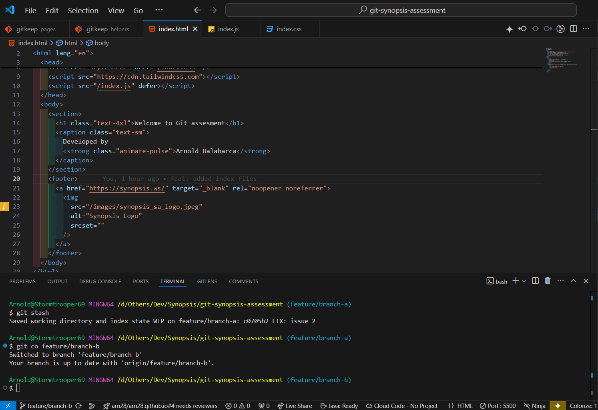

4. Al terminar de trabajar en la _rama B_, puedo volver a la rama A `feature/branch-a` y recuperar mis modificaciones utilizando `git stash apply`, que traera los ultimos cambios guardados en stash
   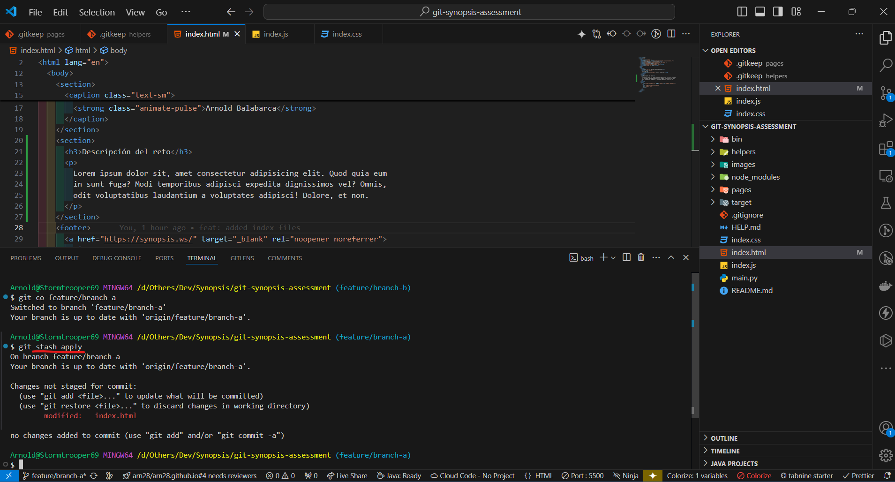

   _Nota: Se puede utilizar el identificador o nombre con que se guarda un stash para traer cambios especificos de ese stash de la siguiente manera: `git stash apply nombre-stash`_

### Actividad 7 - release

1. Cuando se tenga una versión de nuesta app o similar, se puede generar un tag de version. Utilicé `git tag -a v1.0.0 -m "alpha version"`

   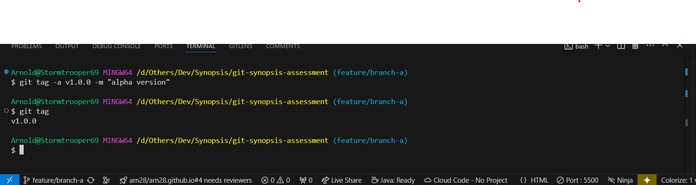

2. Luego la publiqué en el repositorio remoto usando `git push origin --tags`

   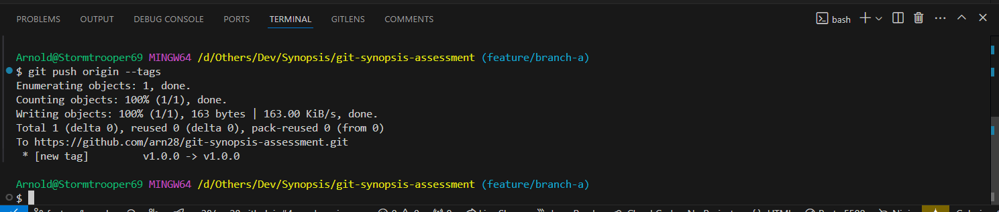

3. Asi al final podemos visualizar las tags del repositorio

   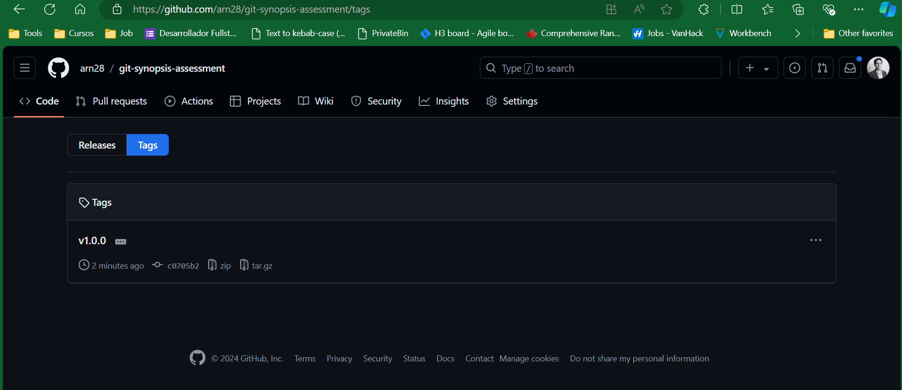

## Actividades Extas

### Actividad 1 - Devolver fichero de staging

1. Empecé teniendo 2 archivos agregados en staging

   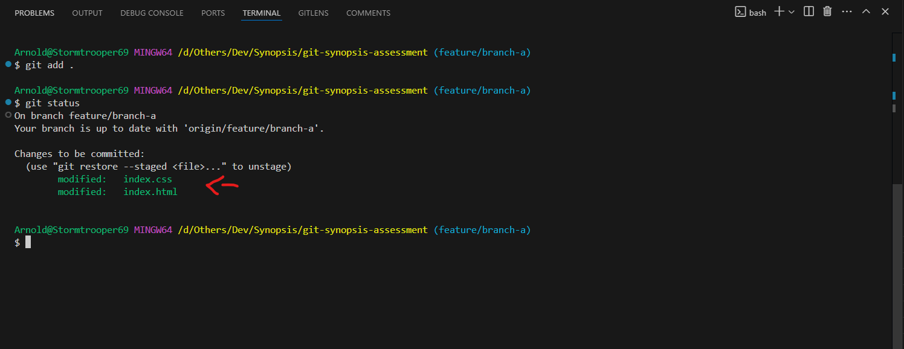

2. En este caso yo quiero quitar de staging a `index.css`, y lo hago **por consola** mediante `git restore --staged index.css`, solo se tiene que indicar el nombre del fichero al final para quitarlo de staging como se observa al final con `git status`.

   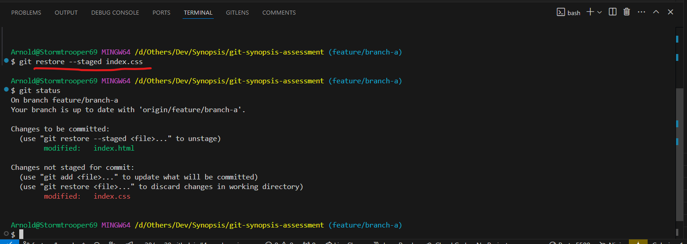

### Actividad 2 - Deshacer ultimo commit

1. Empecé enlistando los commits realizados con `git log --oneline`y veo que quiero deshacer el ultimo commit.
   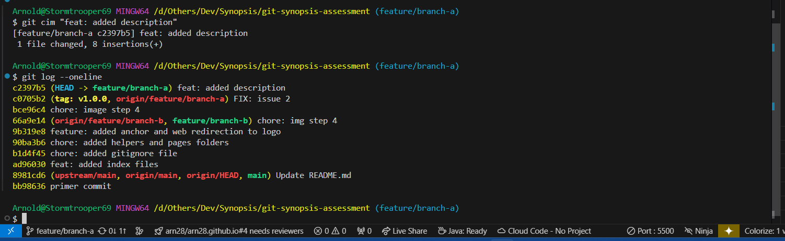

2. Para esto utilizare `git reset HEAD~1`, el cual deshace el último commit pero sin perder los ultimos cambios, es decir no los descarta.

   _Nota: Si lo que quiero es volver al ultimo commit pero sin mantener los cambios de este, utilizare el parametro `git reset --hard HEAD~1`_

   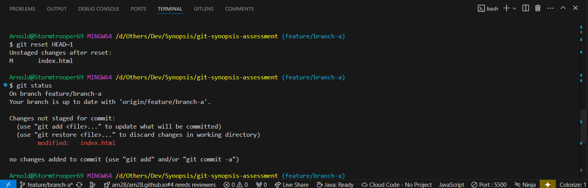

3. Si lo que queremos es deshacer los cambios hasta un commit en especifico, reemplazaremos `HEAD~1` por el identificador del commit que optenemos mediante `git log` y asi podremos restaurar

   _Nota: Si el commit ya fue enviado al repositorio remoto o sea se hizo `git push`, lo que debemos hacer es primero seguir los pasos descritos anteriormente y luego mediante `git push origin -f -u` forzar los cambios hasta el commit deseado. Sin embargo esto puede ser peligroso sin no se tiene cuidado_.

   [Material estra sobre `git reset`]('https://www.git-tower.com/learn/git/faq/undo-last-commit')
