# Solución

1. Realicé el fork del repositorio.
   
2. Cloné desde mi repositorio.
   

## Actividad 1

1.  Después de clonar el repositorio a mi entorno local, creo la rama A con el código `git checkout -b ramaA`, lo que hace que seleccione la rama luego de crearla.
    

2.  En seguida, creé una carpeta llamada `src` en la que incluí 3 archivos. Para luego sincronizar con el repositorio remoto con el comando `git push --set-upstream origin ramaA`.
    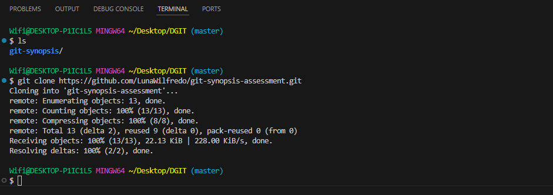

## Actividad 2

1.  Creé el archivo `.gitignore` en el cual agregué las carpetas que estaban excluidas del historial de cambios.
    

## Actividad 3

1.  Creé dos carpetas, luego, dentro de cada uno añadí archivos `.gitkeep` lo cual permite que las carpetas vacías se puedan trackear.
    

## Actividad 4

1.  Verifiqué el estado de mis archivos en mi repositorio local y los agregué al stagging area.
    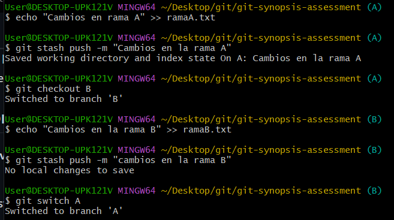

2.  En seguida, generé el commit e hice push para que se mande al repositorio remoto.
    

3.  Acto consecuente, creé y me moví a la rama B, duplicando el contenido de la rama A.
    
4.  Modifiqué el archivo index.html de la rama B y pusheé la rama al repositorio remoto.
    

5.  Me moví a la rama A para poder hacer el merge con la rama B, eso hizo que lo modificado en la rama B pase a ser contenido de la rama A.
    
    

## Actividad 5

1. Me moví de rama a hotfix/main para poder ver los commits de la rama con `git log`, copiamos el id del FIX: issue 2.
   
2. Volví a la rama A para poder integrar el commit deseado. Esto lo hacemos con `git cherry-pick {id que copiamos anteriormente}` . En este caso, hay conflictos, seleccionamos los cambios que vienen del commit que queremos ingresar.
   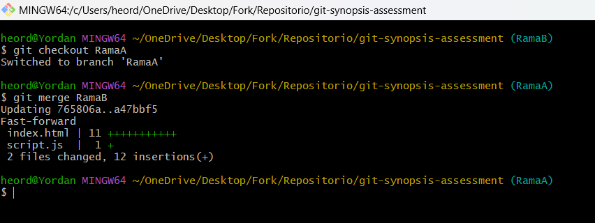

3. Luego, hice el commit ya con la integración anterior, como se muestra en la imagen, el contenido deseado ya se encuentra en la rama A.
   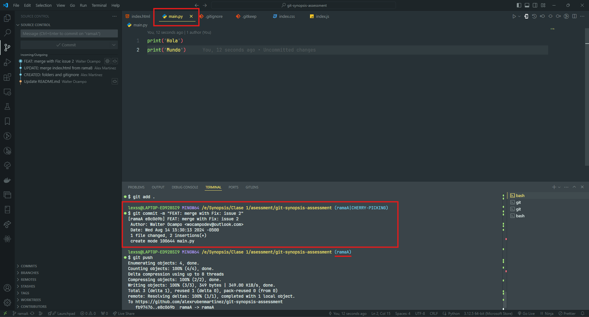

## Actividad 6

1. Cuando se desea modificar ramas diferentes simultáneamente sin generar commits, la opción más viable es con los stashes. Se logra con el comando `git stash` y se genera una instantánea del proyecto sin generar commits.

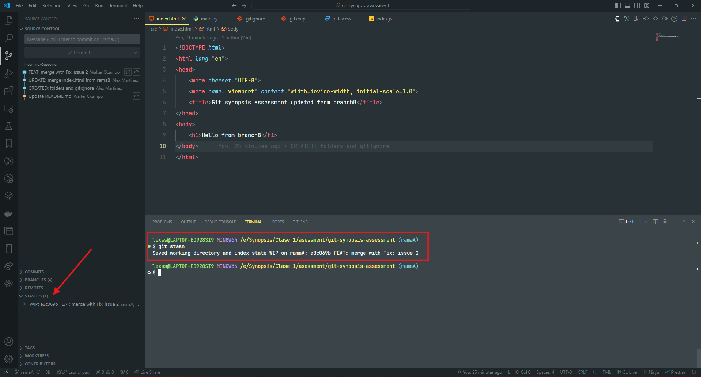 2. Me moví a la rama B, hice los cambios que quería y también agregué otro stash. Como se puede verificar en la figura, se muestran 2 stash: 1 de la rama A y otro de la rama B.
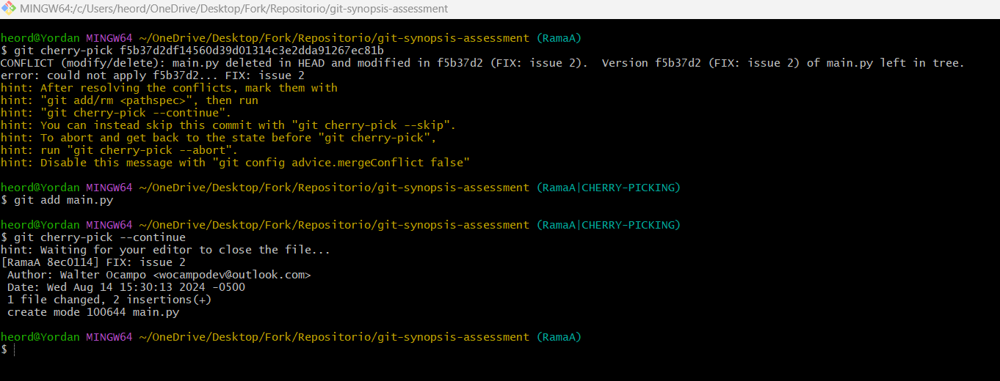 3. Al volver a la rama A, recupero mi stash con el comando `git stash pop` y acepto los cambios guardados en el mismo.
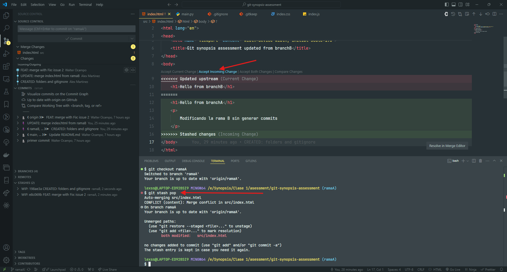

## Actividad 7

1. Para agregarle un tag se utiliza el comando `git tag -a v1.0.0 -m [mensaje]` y para enviarlo al repositorio remoto se usa `git push --tags origin`.
   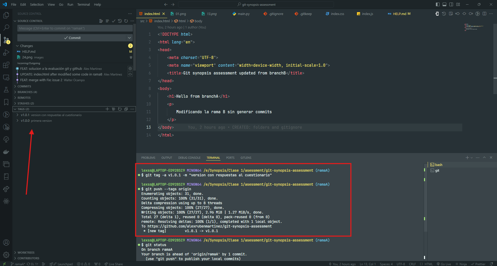

# Extras

## Actividad Extra 1

1. Agregué todos lo archivos con cambios al stagging area con el comando `git add .`, luego vi el estado de cambios con `git status` y como se puede observar, tenemos a index.html esperando a ser commiteado.
   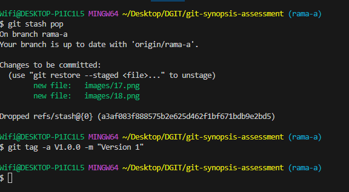
2. Para poder retirarlo de ahí, se logra con el comando `git restore --stagged .` el cual recupera a todos los items dentro del stagging area. También se puede recuperar solo un elemento reemplazando el `.` por el directorio del archivo en el stagging area.
   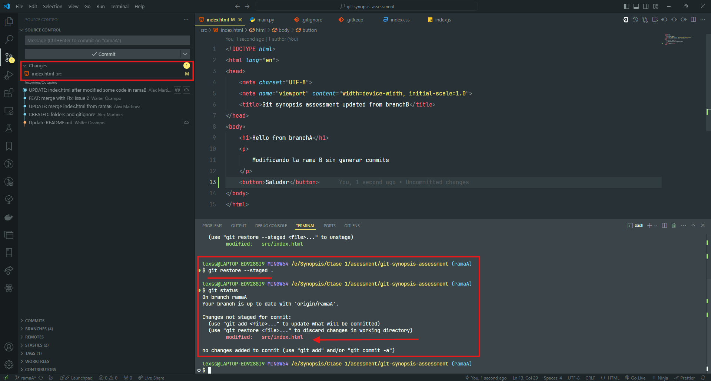

## Actividad Extra 2

1. Para volver a un commit anterior, debemos saber el identificador del commit.
   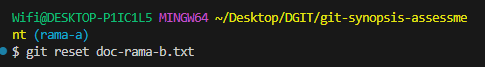
2. Con ese dato, podemos usar el comando `git reset --soft {identificador}` o `git reset --hard {identificador}` para volver al commit anterior.
   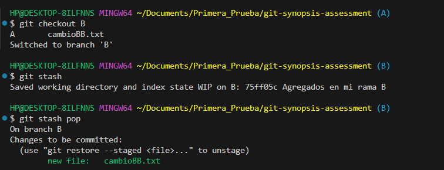
