# Solución

## Actividades Previas
  

### Generar un **fork** de este repositorio a su propia cuenta de Github.
  
1. En la página del repositorio hice click en el boton **fork**.
   
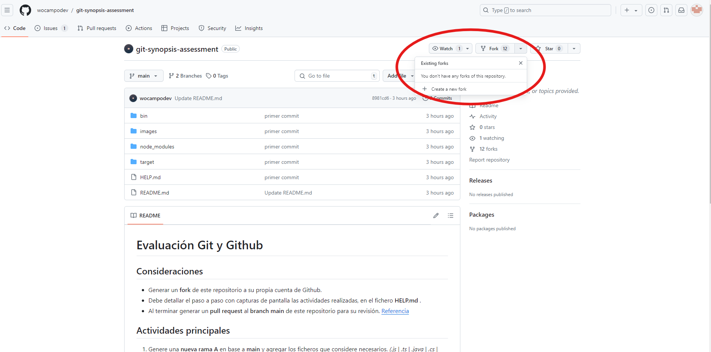

2. Deseleccione *copy the main branch only* ya que tambien necesitaba la rama **hotfix/main**.
   

 

3. Hice click en **Create fork**.
  
### Clonar el repositorio(fork).

1. Copie el url y ejecute el comando **git clone** en la consola.
   
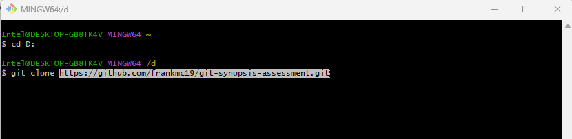
   
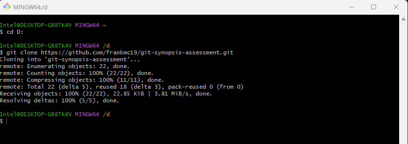

## Actividades Principales
  

### Actividad 1: Genere una **nueva rama A** en base a **main** y agregar los ficheros que considere necesarios. *(.js | .ts | .java | .cs | .html | etc)*.

1. Para crear la rama **rama_A** use el comando **git checkout**.
   
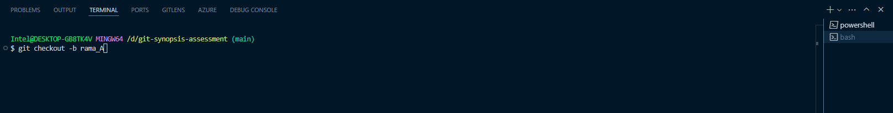

2. Cree el fichero **index.html**.
   
3. Añadí **index.html** a la *staging area* con el comando **git add**.
   
4. Hice commit al repositorio local.
   
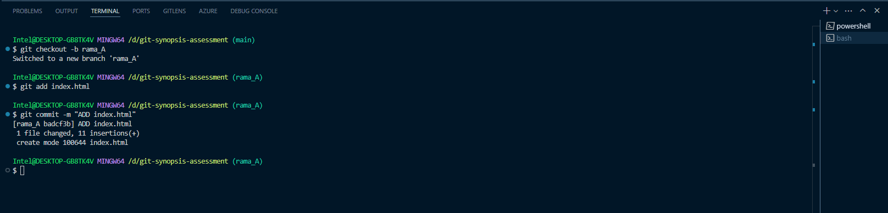

  
### Actividad 2: Restringir del historial de cambios a las carpetas **/bin**  **/node_modules** y **/target**.

1. Cree el fichero **.gitignore**.
   
2. Agregué las restricciones.
   
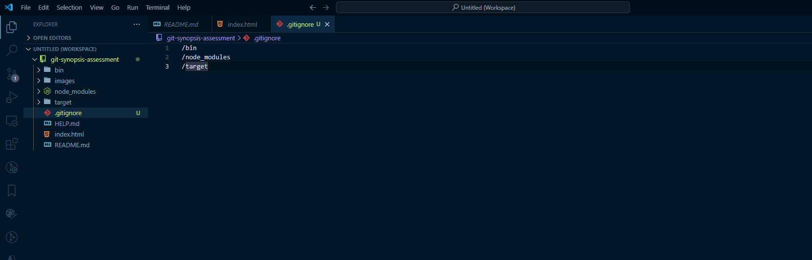

3. Hice commit al repositorio local.
   
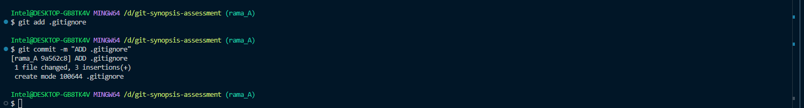

  

### Actividad 3: Generar 2 carpetas cualquiera sin contenido que sean incluidas en el historial de cambios.

   * Como git no gestiona carpetas sin contenido, es necesario la creación de ficheros **.gitkeep**
   
1. Cree las carpetas: carpeta_1 y carpeta_2 con un fichero .gitkeep en cada una.
   
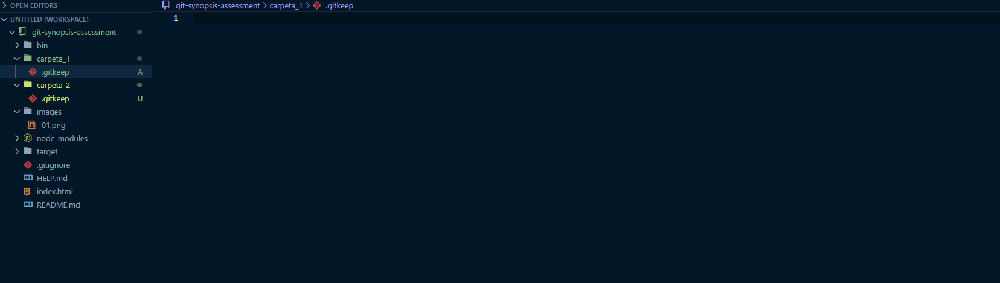

2. Añadi los archivos **.gitkeep** para así añadir las carpetas.
   
3. Hice commit al repositorio local.
   
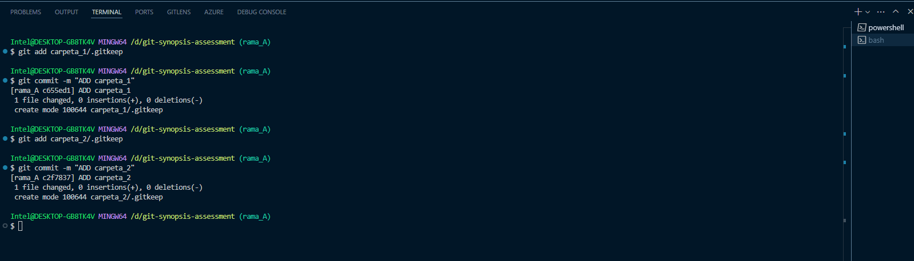

  

### Actividad 4: Generar **otra rama B** para realizar nuevas modificaciones y luego integrar estos en la **rama A**.

1. Use el comando **git checkout** para crear la rama **rama_B**.
   
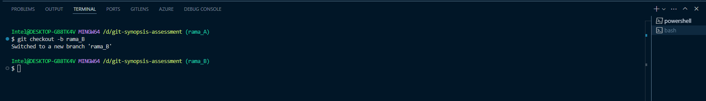

2. Cree el fichero **estilos.css**.
   
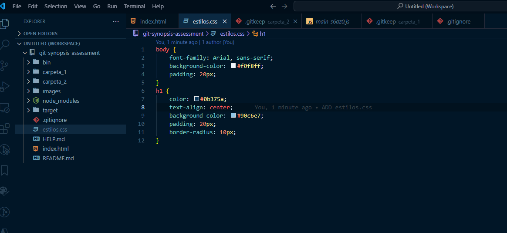

3. Modifique el fichero **index.html**.
   
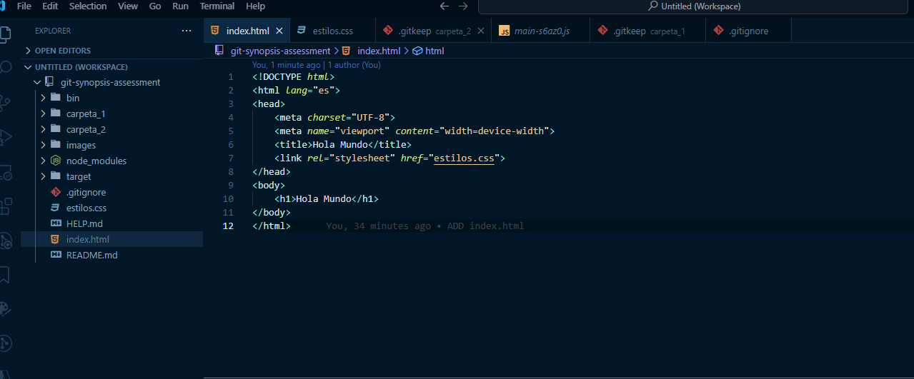

4. Añadí los cambios realizados.
   
5. Hice commit al repositorio local.
   
  
   
6. En la rama **rama_A** use el comando **git merge** para integrar los cambios de la rama **rama_B**.
   
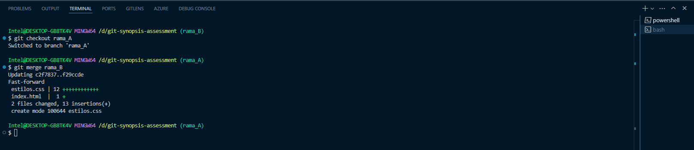

### Actividad 5: Integrar **SOLO** el commit con nombre *"FIX: issue 2"* de la rama **hotfix/main** en la **rama A**.

1. Copie el hash del commit **FIX: issue 2** en la rama **hotfix/main**.
   
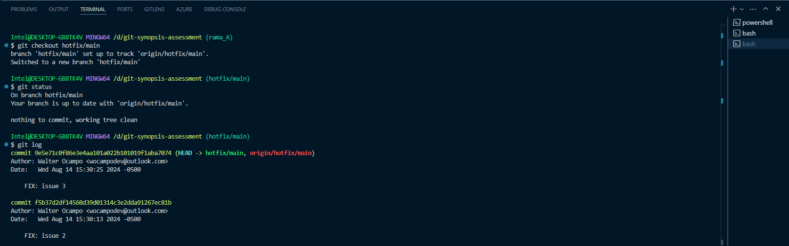  

2. En la rama **rama_A** use el comando **git cherry-pick**.
   
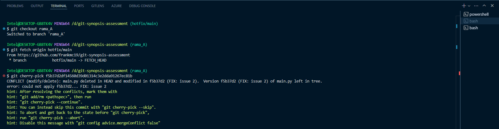

* Existe un conflicto ya que main.py no existe en **rama_A** y en el commit **FIX: issue 2** se edita el fichero main.py.
   
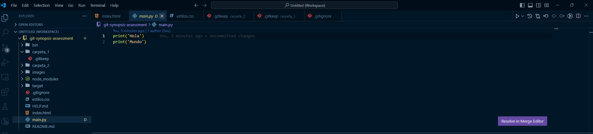

3. Para solucionar el conflicto añadí el fichero.
4. Para continuar con el comando **git cherry-pick** use *cherry-pick --continue**.
   
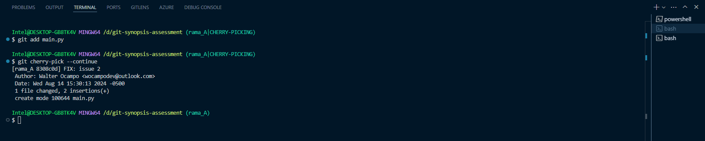
  

### Actividad 6: Ejemplifique el uso de git para la modificación de ficheros en la rama A y en la rama B simultaneamente **sin generar commits en el historial de cambios**.

1. En la rama **rama_A**, edite el fichero **index.html**.
   
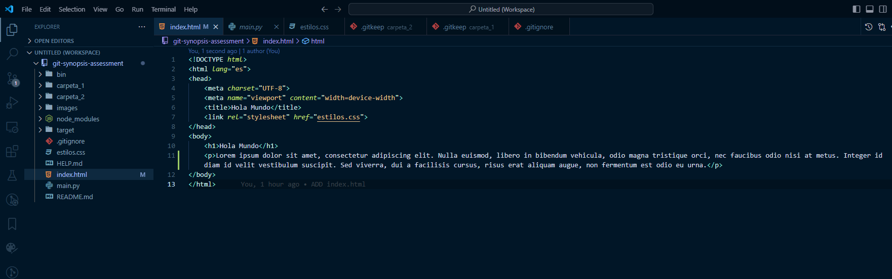

2. En la rama **rama_B**, edite el fichero **estilos.css**.
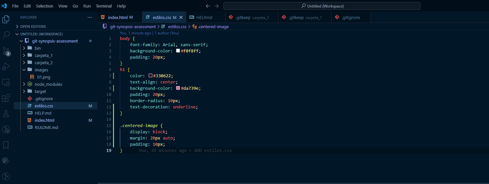

3. En la rama **rama_B**, edite el fichero **index.html**.
   

4. Use **git stash** para almacenar temporalmente una captura de los cambios realizados.
   
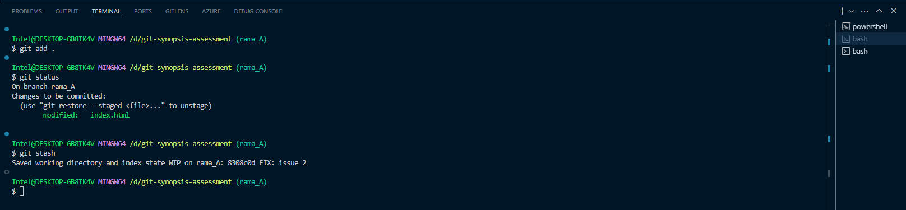
   
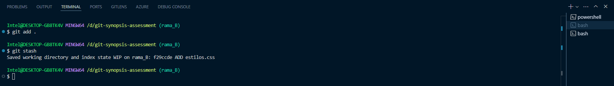
  

### Actividad 7: Ejemplifique el uso de git para la generación y publicación de un **nuevo release (versión)** de su código.

  
1. Use el comando **tag** para añadir la version v1.0.0 en la rama **main**.
   
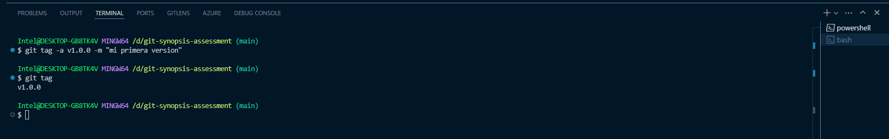

2. Para subir los cambios y la version al repositorio use el comando **git push origin v1.0.0**.
   

## Extras
  

### Extra 1: Ejemplique el uso de git para devolver un fichero del **staging area** al estado anterior.

1. Para el ejemplo añadi unos cambios a los ficheros **index.html** y **estilos.css**.
   
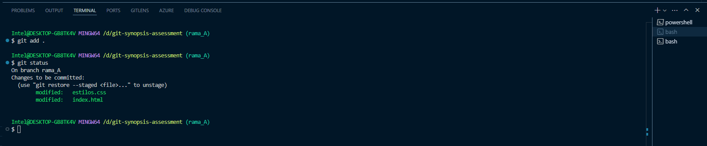

2. Para devolver el fichero use el comando **git reset**.
2. Use **status** para verificar que el fichero ahora se encuentre solo como modificado.
   
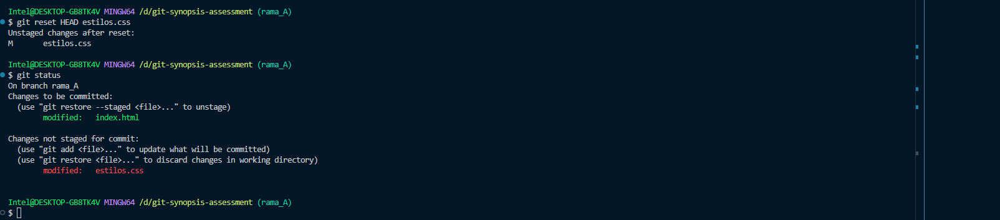
  

### Extra 2: Ejemplifique el uso de git para regresar en el tiempo hacia un **commit anterior en la rama A** de su repositorio remoto propio.

1. Use el comando **reset --hard** para regresar al commit **ADD estilos.css** usando su hash.
   
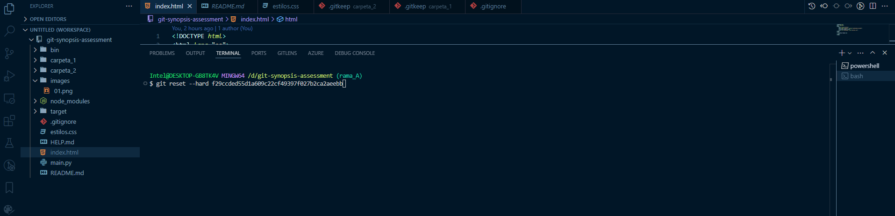

2. El fichero main.py es borrado ya que este fue añadido en el ultimo commit de la rama **FIX: issue 2**.
   
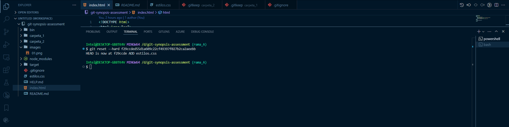

  

### Investigar sobre **git reset**

Git reset es un comando potente en Git que permite deshacer cambios en el repositorio. Tiene tres modos:

* **soft**: Mueve el HEAD a un commit anterior, pero mantiene los cambios en la *staging area*. .

        git reset --soft <commit hash>

* **mixed** (por defecto): Mueve el HEAD a un commit anterior, quita los cambios de la *staging area*, pero los deja en el directorio de trabajo.

        git reset --mixed <commit hash>

* **hard**: Mueve el HEAD a un commit anterior, eliminando los cambios de la *staging area* y del directorio de trabajo. Esto deshace completamente los cambios y no se puede revertir fácilmente.

        git reset --hard <commit>
