# Solución

# Antes de las actividades:

1. Hice “fork” presionando el botón en la parte superior derecha:

    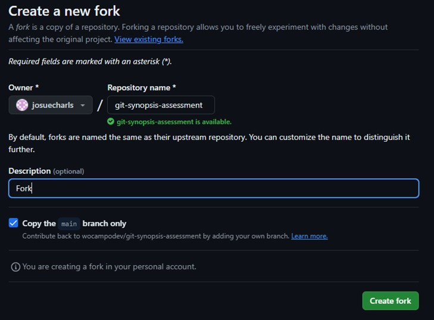

2. He creado el fork en mi cuenta: 

    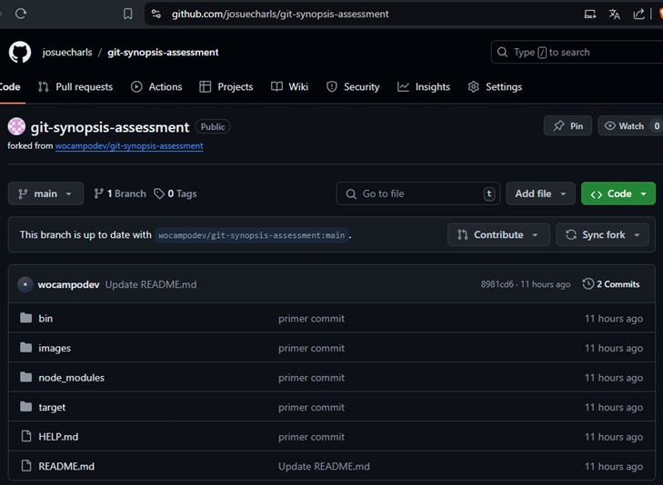

3. Inicializo git en mi pc, y clono la dirección:

    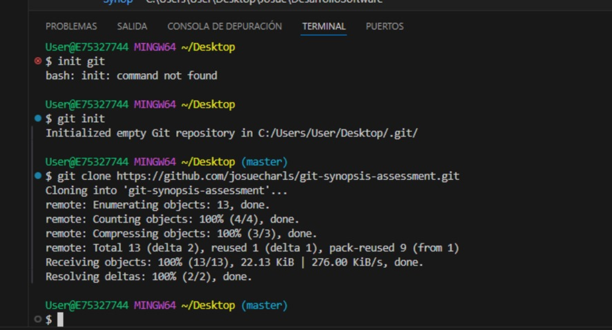

## Actividad 1

1. Agrego los archivos necesarios:

    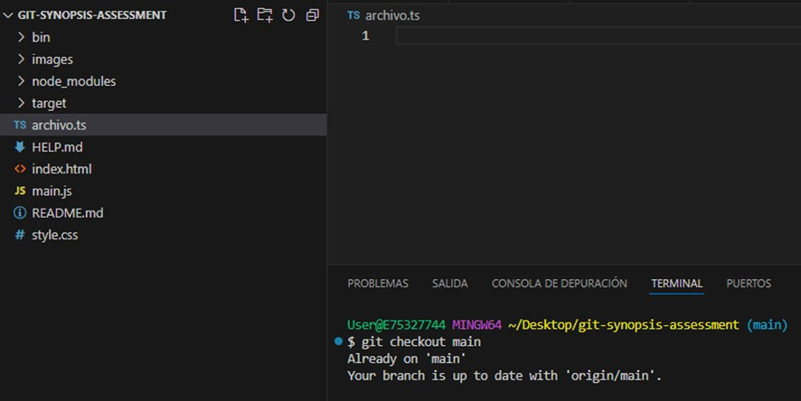

2. Agrego con la rama main

    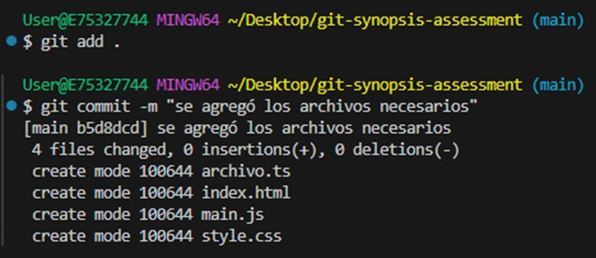

3. Creo mi Rama A, hago merge:

    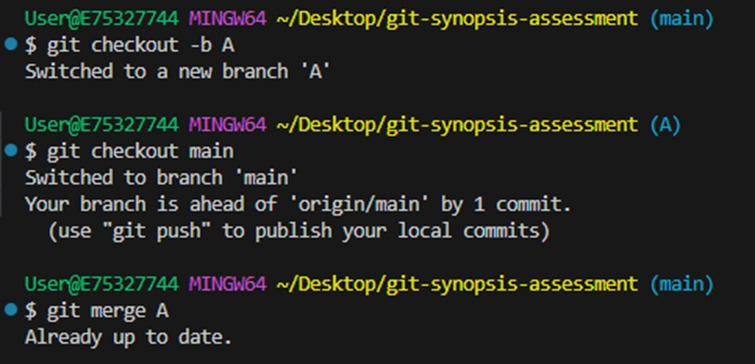

4. Reviso con git log –oneline para ver el historial completo, y hago push en A

    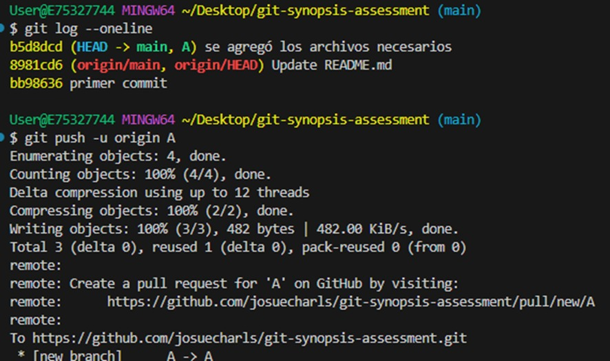
  
5. Reviso mi repositorio remoto y visualizo la creación del Branch y lo agregado:

    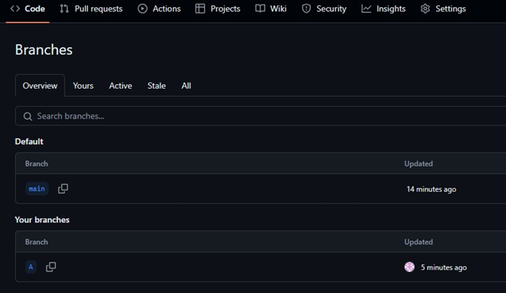
    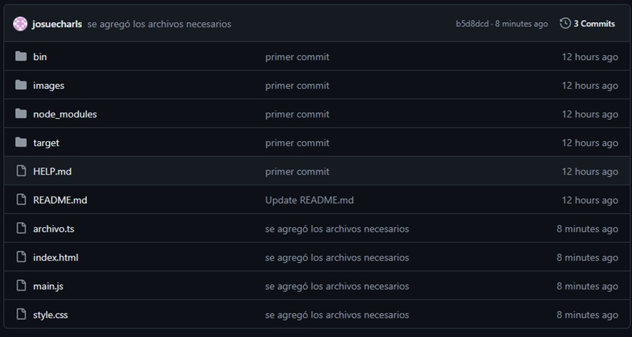
 
# Actividad 2:
1. Creo el archivo “.gitignore”, edito y hago push:

    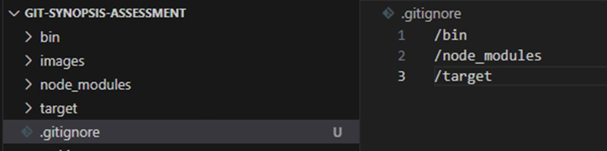
    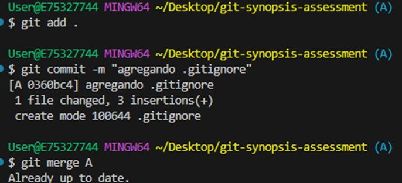
 
# Actividad 3:
1. Creo mis carpetas vacias con el git Bush:

    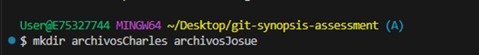
 
2. Y dentro de cada uno creo el archivo “.gitkeep” para que a pesar que no tengan archivos, sean incluidas en el historial de cambio:

    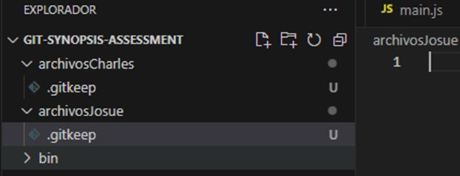

# Actividad 4
1. Creo una nueva rama B y las integro en la rama A.
 
    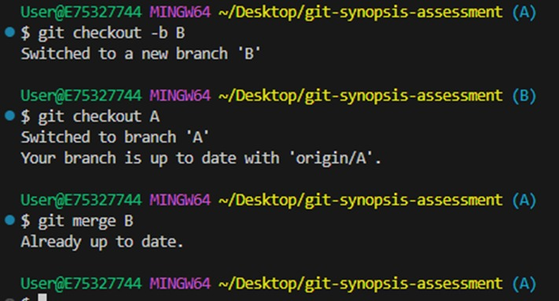

# Actividad 5
1. Primero que todo, como no existe en el remoto, he creado la rama hotfix/main.
 
    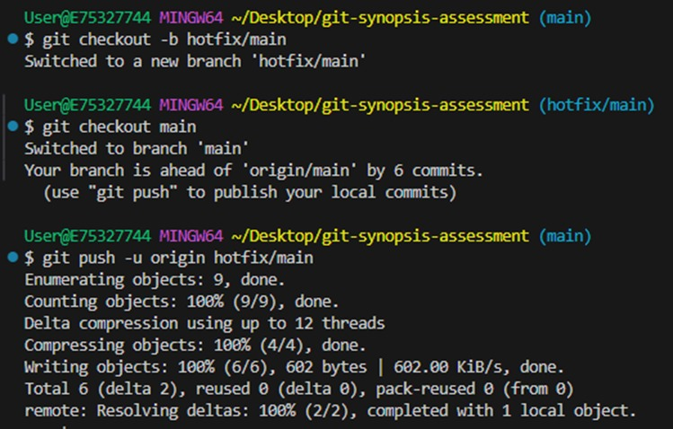
    

2. Verifico el commit creado:
 
    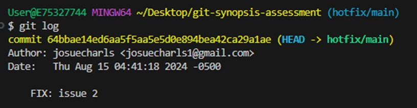

3. Integro solo el commit a la rama A:

    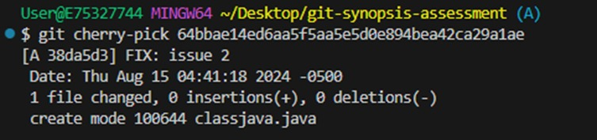

# Actividad 6
1. Para esto vamos a usar “git stash”. Modifico los archivos en la rama A y B.

    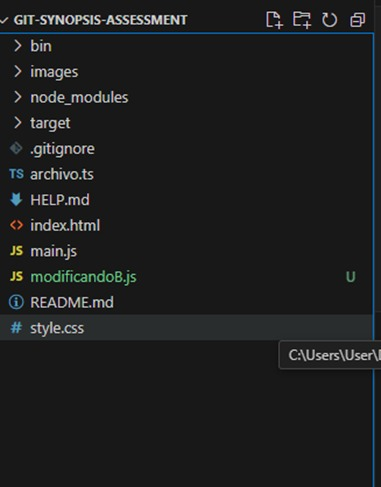
    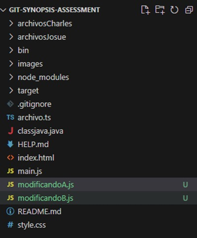
   
2. Agrego y pongo git stash para guardarlo en el directorio de trabajo

    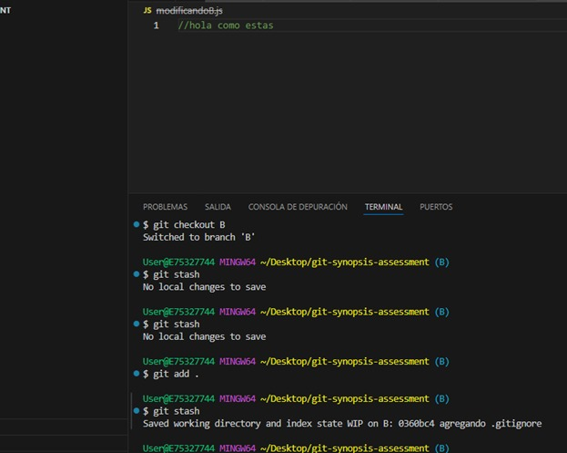
 
3. Luego “git stash pop”, y aparece el archivo, sin necesidad de agregar “commit”
 
    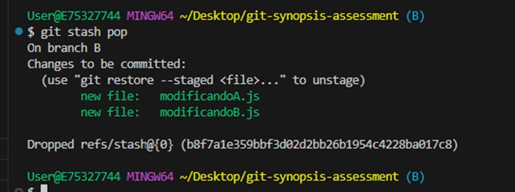

# Actividad 7
1. Agrego una versión a mi proyecto con el “git tag”

    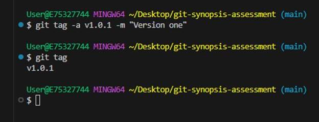
 
2. Subo y reviso la creación de mi versión:

    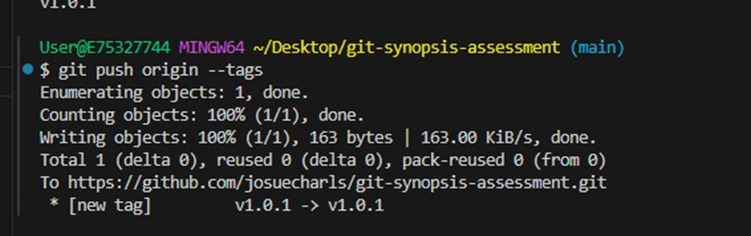
    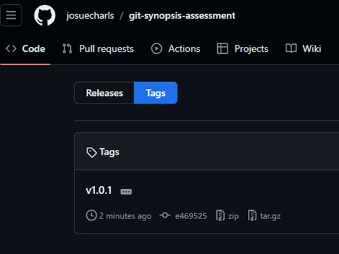
 
3. Creo un Release

    
    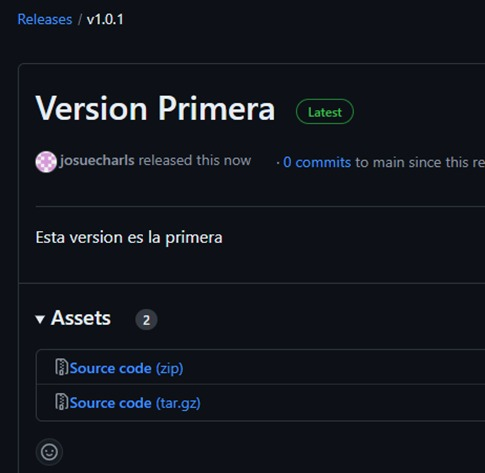
  
# ACTIVIDADES EXTRAS:

# EXTRA 1:
1. Agregué un archivo al staging área.

    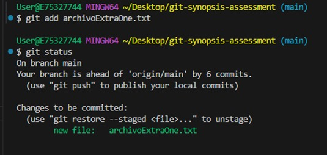

2. Lo modifiqué, e hice commit; luego deshice los cambios y lo devolví al directorio y al final se revirtió al estado del último commit

    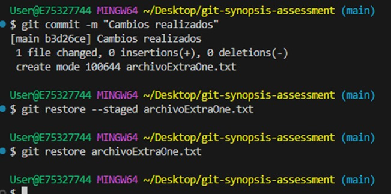
 
# EXTRA 2:
1. Primero voy a mi rama A, y veo los commits, y como no quiero que se elimine todos los cambios uso “git reset --soft”

    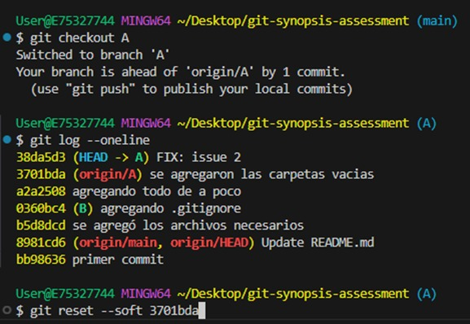
 
