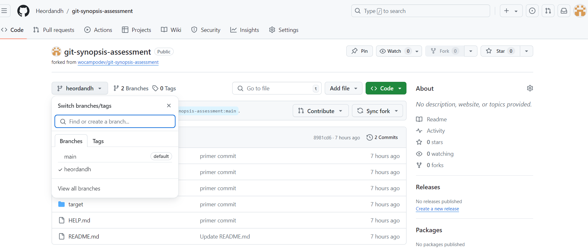
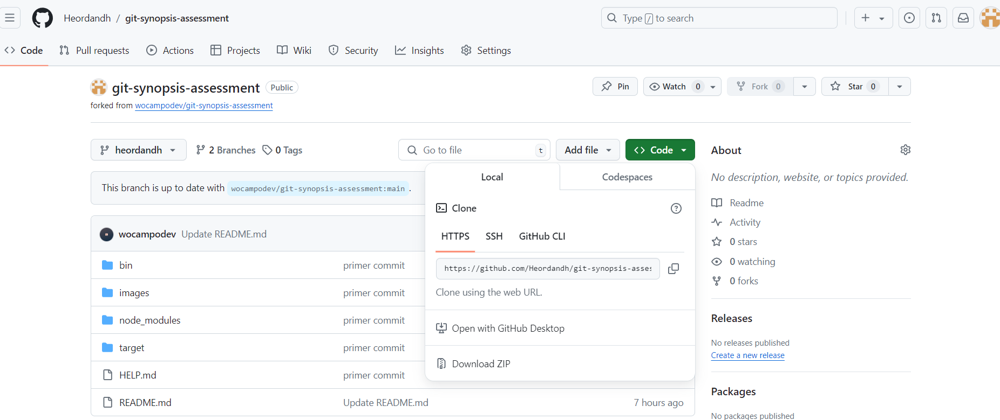

# Solución

## Actividad 1

1. Hice crear una rama feature/joelhuaman y agregue el archivo node_modules/main-s6az0.js a mi rama.

    

2. Hice cree un archivo gitignore para  restriguir cambios de node_modules/ bin/target/

    
3. Hice cree dos carpetas con los nombres carpeta 1 y carpeta 2,lo agregue los cambios a la rama.

    