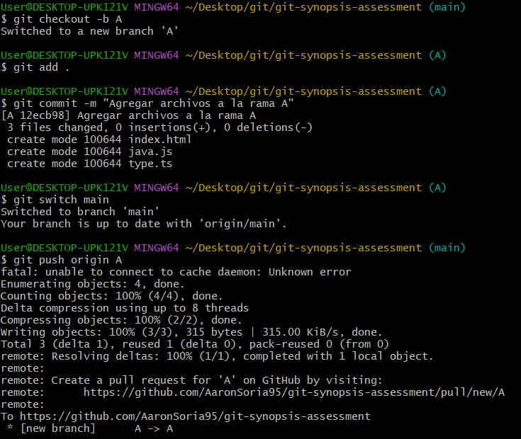
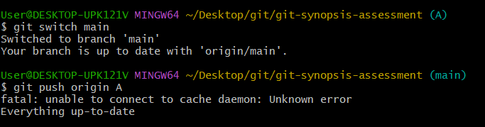

# Solución

## Actividad 1

1. Primer paso hice la clonación del fork en mi propia GITHUB 

2. Clone el repositorio en mi equipo e ingresé. 

3. Genere una nueva rama llamada "A" y cree algunos archivos nuevos. 

 3.1 Se muestra de como se subieron los cambios. 

4. Restringir del historial de cambios creando un archivo .gitignore. 

 4.1 Se muestra de como se hicieron os cambios. 

5. Se crearon las 2 carpetas que se solicitó que incluyan el historial. 

6. Se creo una nueva rama llamada B para que luego sea integrada en A. 

 6.1  Se muestra de como se realizó la nueva rama y la integración. 

7. Se realizó una descarga de la rama hotfix/main del docente, se estrajo solo lo indicado y se integró en A.

8. Para el ejemplo se uso el git stash ya que guarda los cambios temporalmente en diferentes ramas y aplica esos cambios.

9. Preparar el código en la rama principal. 

 9.1 se crea una etiqueta para el nuevo release usando git tag

 9.2 se su la etiqueta a la repo
 
 9.3 se publica en GIthub a traves de la interfaz web.

10.  Ejemplique el uso de git para devolver un fichero del staging area al estado anterior: se usaría el git restore para poder   eliminar el archivo del staging area, manteniendo los cambios en el directorio de trabajo.
Por ejemplo: si se usa el git restore --staged texto.txt esto elimina el archivo del staging area pero conserva las modificaciones en el directorio de trabajo.

11. Según lo solicitado el git reset, regresa la rama a un commit anterior, manteniendo cambios en el staging area. Por ejemplo: 
git reset --hard abc1234-> este comando descarta todos los cambios en el directorio de trabajo y en el staging area.
git reset --soft abc1234-> mantiene los cambios en el staging area y en el directorio.
git reset -- mixed abc1234-> mantiene los cambios en el directorio pero no en el staging area.