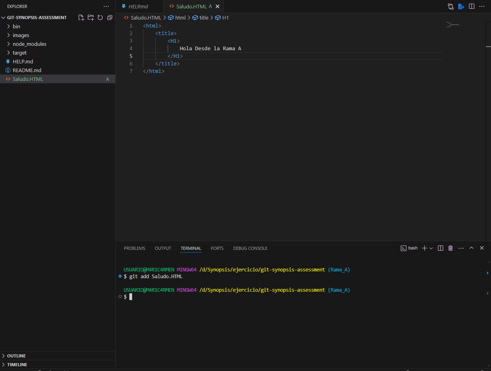
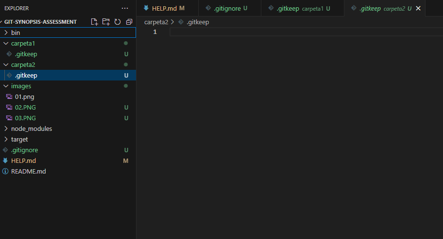
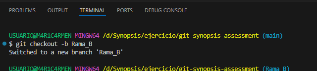
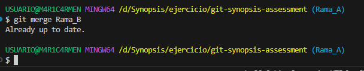
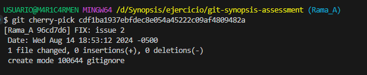
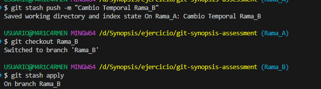
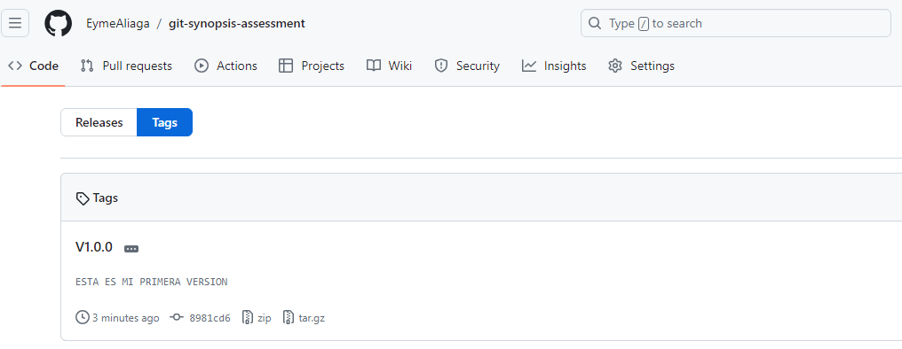
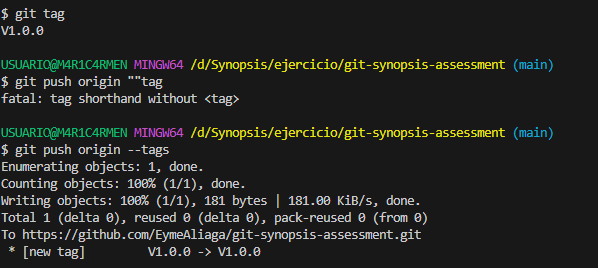

# Solución

## Actividad 1

1. Ejemplo de imagen

    

2. Hice la Rama_A y le puso un archivo .HTML

    

3. Hice un archivo .gitignore para restringir el historial de cambios

    

4. Hice dos carpetas con nombres Carpeta1 y Carpeta2 cada una con un archivo .gitkeep

    

5. Hice la creación de la Rama_B

    

6. Hice la ingreción de la Rama_B en la Rama_A
  
    

7. Commit de la rama hotfix/main

   

8. Rama_A y Rama_B simultaneamente
  
   

9. Versiones o tags
    

10. Tag en consolas
  
    

11. Pull Request

   