1. **Creación de la Rama "A"**
   - Después de clonar el repositorio localmente, creé la rama `A`.

   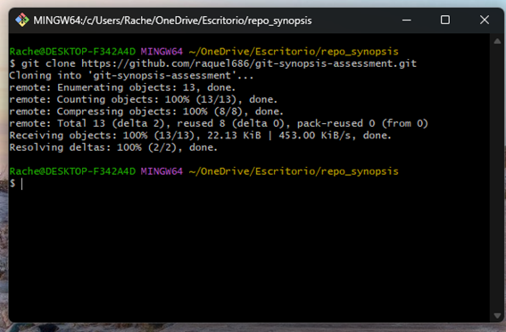
   
    
   

3. **Restringir el Historial de Cambios**
   - Restringí del historial de cambios a las carpetas `/bin`, `/node_modules`, y `/target` mediante un archivo `.gitignore`.

    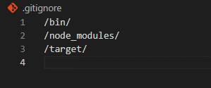

4. **Generación y Adición de Carpetas**
   - Generé las carpetas `carpeta_ejemplo1` y `carpeta_ejemplo2` y las añadí al stage usando archivos `.gitkeep` vacíos.

    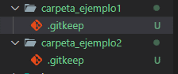

5. **Commit y Merge de Ramas**
   - Cometí mis cambios en la rama `A` y creé la rama `B` a partir de `main`. Luego hice cambios en `B` y los cometí. Finalmente, volví a la rama `A` donde hice el merge con la rama `B` para integrar los cambios de esta en `A`.

   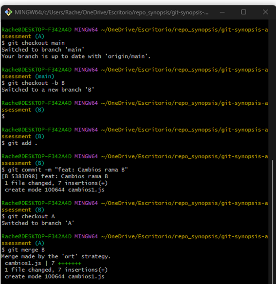

6. **Integración de un Commit Específico**
   - Para integrar solo el commit `FIX: issue 2` a la rama `A`, primero busqué el identificador del commit con `git log` y luego realicé un `git cherry-pick` en la rama `A`.

   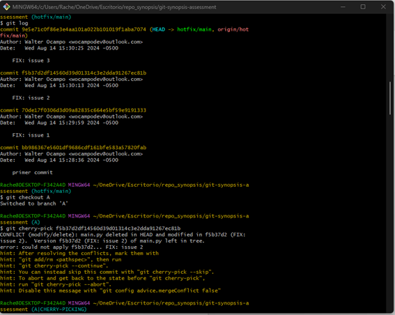

7. **Modificaciones Simultáneas en Ramas**
   - Para hacer modificaciones en la rama `A` y `B` simultáneamente sin realizar commits, primero añadí los cambios al área de trabajo y luego a un stash con ayuda de `git stash`. Esto los almacena temporalmente y permite cambiar entre ramas. Al cambiar a la rama `B`, también realicé algunos cambios y los guardé en el stash. Al volver a la rama `A`, para traer los cambios del stash de `A`, lo hice buscando el stash específico en la lista de stash.

   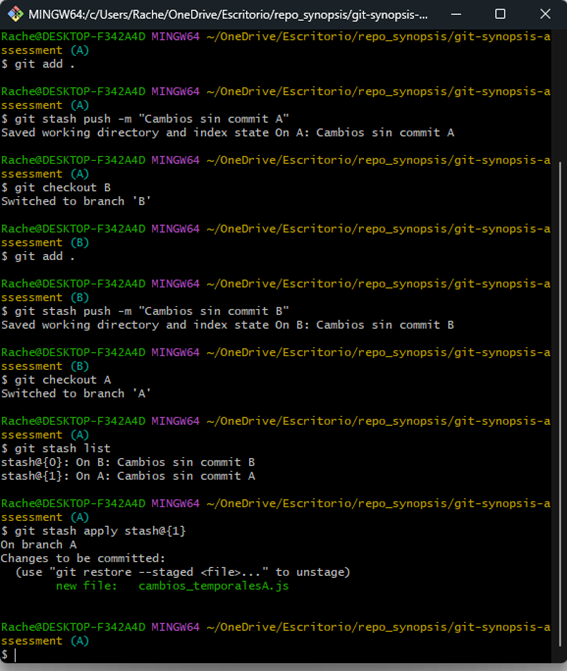

8. **Generación y Publicación de una Nueva Versión**
   - Generé y publiqué la nueva versión a partir de la rama principal `main`.

   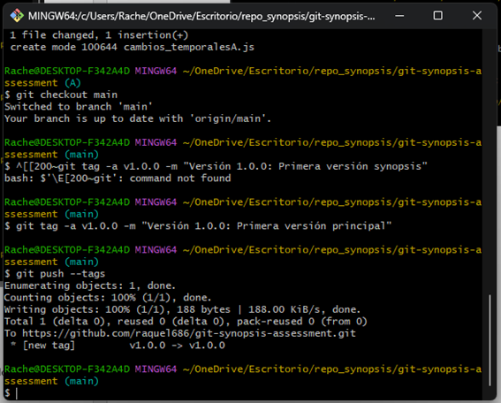

## Extras

1. **Devolver un Fichero al Estado Anterior**
   - Para devolver el fichero `cambios_temporalesA` a su estado anterior, utilicé `git reset`, lo que lo sacó del staging area, como se puede ver al poner el comando `git status`.

    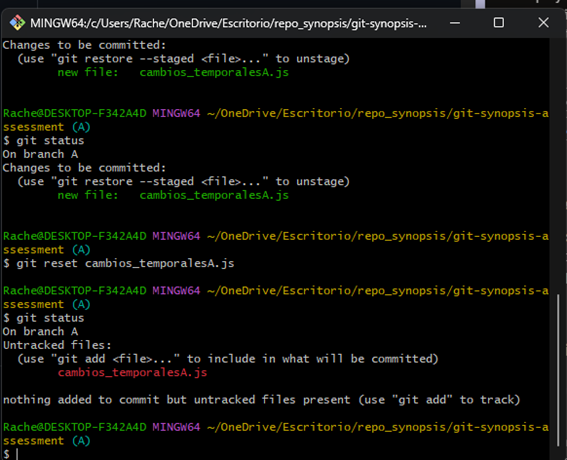

2. **Revertir al Commit Anterior**
   - Como el último commit en la rama `A` es `feat: cambio temporal A`, lo revertí al penúltimo que es `FIX: issue 2`, haciendo uso de `hard reset` y forzando un push en el repositorio remoto. Al final quedó en que el último commit es `FIX: issue 2`.

    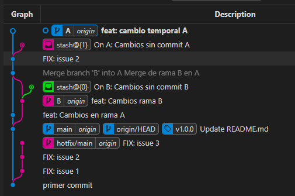

    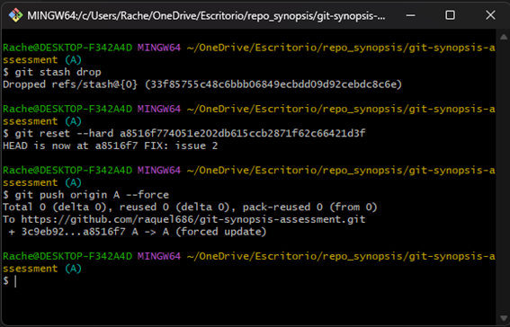

    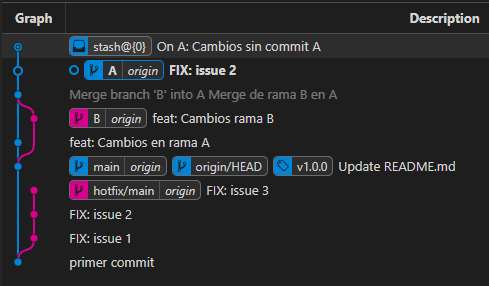
