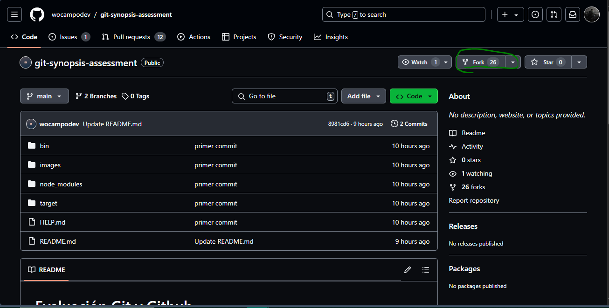
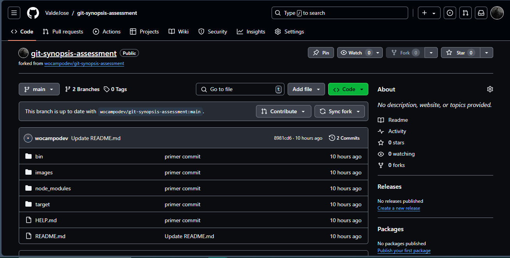
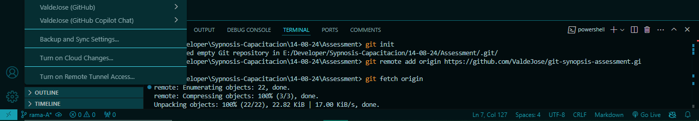

# Solución

## Actividad 1
1. Genere un fork desde el repositorio 'git-synopsis-assessment' hacia mi cuenta de github
    
    
2. Usando la terminal de VScode, inicialice git en una carpeta local ('git init'), para luego conectarla con mi repositorio remoto ('git remote add origin')
    
3. Genere una nueva rama'rama-A' a partir de la rama 'main' desde el terminal, haciendo un pull desde la rama main
    
4. 
5. 
    

## Actividad 2

2. Hice Y

    ...
