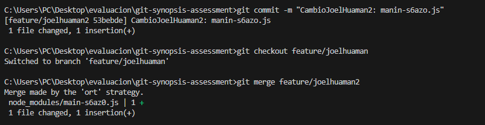
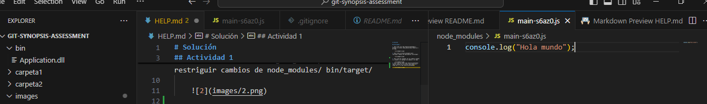
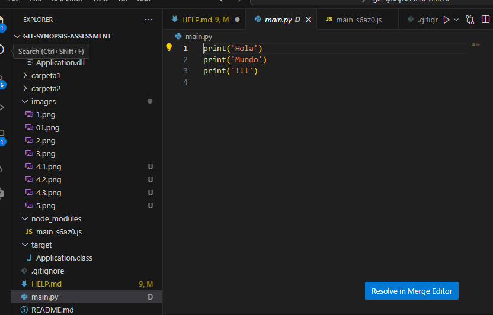
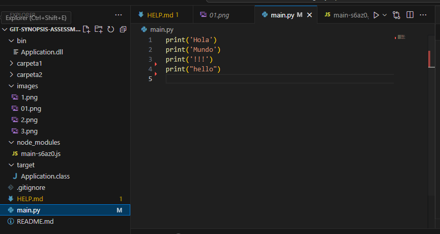
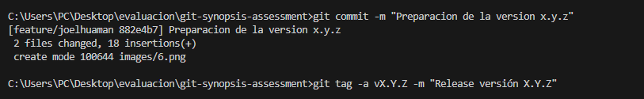
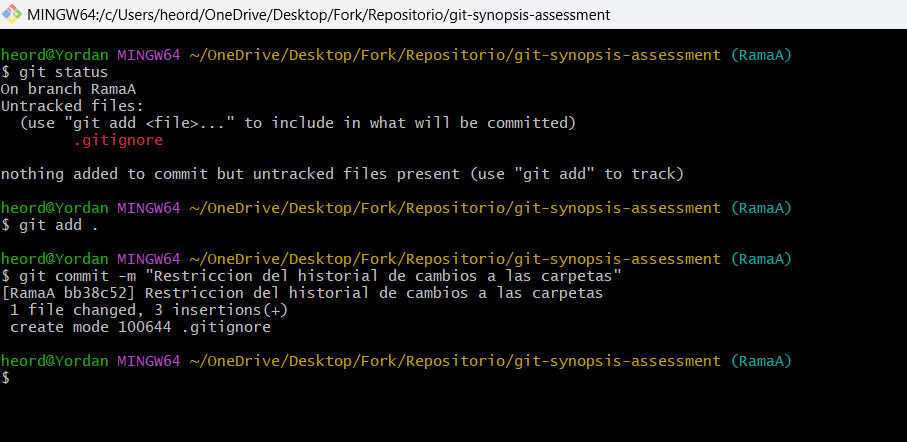

# Solución

## Actividad 1

1. Hice crear una rama feature/joelhuaman y agregue el archivo node_modules/main-s6az0.js a mi rama.
codigo:
git branch -v
git branch feature/joelhuaman
git add node_modules/main-s6az0.js
    

2. Hice cree un archivo gitignore para  restriguir cambios de node_modules/ bin/target/

    

3. Hice cree dos carpetas con los nombres carpeta 1 y carpeta 2,lo agregue los cambios a la rama.
codigo:
mkdir carpeta1 carpeta2
git add carpeta1 
git add carpeta2

    
4. Hice cree una nueva rama feature/joelhuaman2 realize cambios en la archivo main-s6az0.js y luego unir a la rama feature/joelhuaman 
codigo:
git checkout feature/joelhuaman
git add .
git commit -m "Cambios: manin-s6azo.js"

git branch feature/joelhuaman2
git checkout feature/joelhuaman2
git add .
git commit -m "Cambio: manin-s6azo.js" 

git checkout feature/joelhuaman
git git merge feature/joelhuaman2

    
    
    

5. Hice es traer fix:isse3 de hotfix/main con el siguiente comando para la rama feature/joelhuaman git cherry-pick 9e5e71c 

    
    evidencia 
    

6. Hice crear una nueva rama A y B con que guarde cambios en A y realize cambios en B con el fin de traes los cambios de la rama B a la Rama A
git checkout ramaA
git branch ramaB
git add .
git commit -m "cambios"
git checkout ramaB
modifique en el main print("Hello")
git add .
git commit -m "Cambios B"
git checkout ramaA
git merge ramaB

    evidencia 
    

7. Hice la preparacion de la version x.y.z con los siguientes comandos:
git add 
git commit -m "Preparacion de la version x.y.z"
git tag -a vX.Y.Z -m "Release versión X.Y.Z"

 evidencia 
    

    Extras
1. Se realizo una creacion de un fichero archivo.txt
echo "Nuevas líneas de texto" >> archivo.txt
    git add archivo.txt
    git status
    evidencia 
    

2.se realizo el reseteo en la rama A 
git checkout ramaA
git reset 

evidencia 
    
