# Solución

## Actividades Principales

    Hacemos un fork del repositorio original

    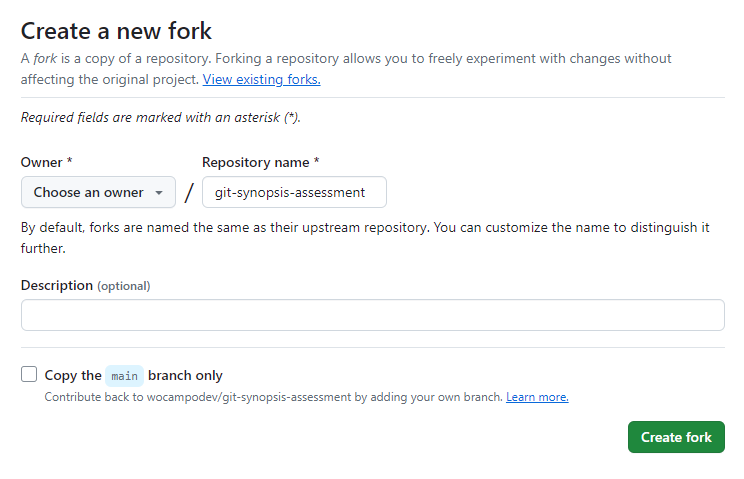

    Clonamos nuestro repositorio en nuestro directorio de trabajo

    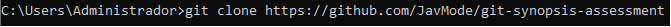

1. Genere una nueva rama A en base a main y agregar los ficheros que considere necesarios. (.js | .ts | .java | .cs | .html | etc).

    Creamos una rama A en base a main y agregamos una carpeta llamada src

    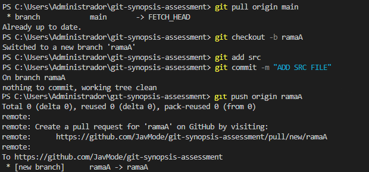
    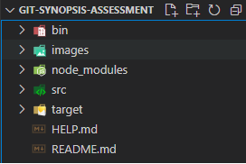

2. Restringir del historial de cambios a las carpetas /bin /node_modules y /target.

    Creamos un file .gitignore y añadimos las carpetas /bin, /node_modules y /target para restringir el historial de cambios

    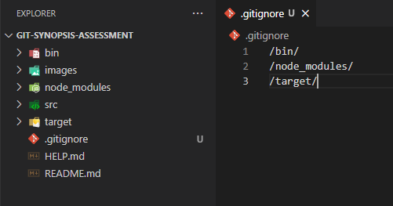

   Pusheamos el archivo .gitignore al repositorio

   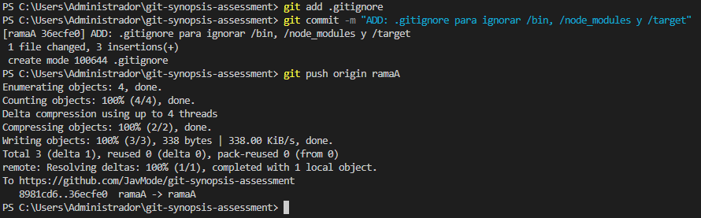

3. Generar 2 carpetas cualquiera sin contenido que sean incluidas en el historial de cambios.

    Creamos 2 carpetas vacías con los archivos .gitkeep para que sean incluidas en el historial de cambios

    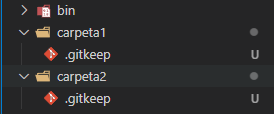
    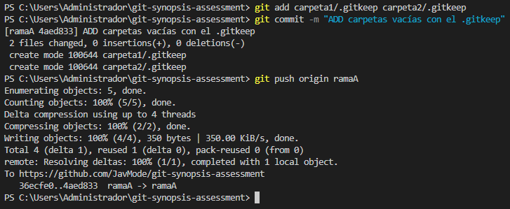

4. Generar otra rama B para realizar nuevas modificaciones y luego integrar estos en la rama A.

    Creamos una rama B a partir de la rama A, genero un archivo main.js en la rama B y finalmente hacemos merge para integrarlo en la rama A

    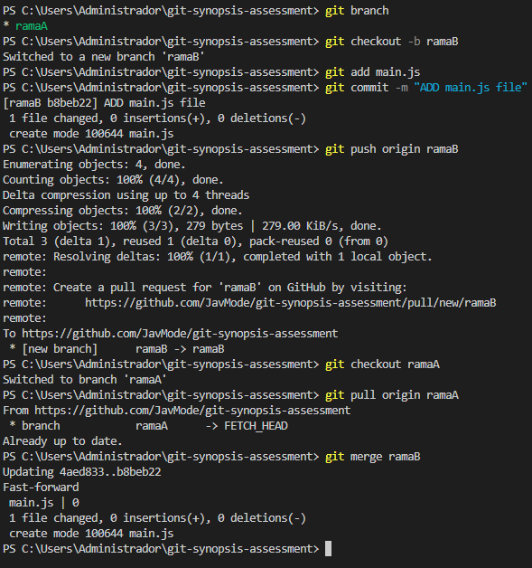

5. Integrar SOLO el commit con nombre "FIX: issue 2" de la rama hotfix/main en la rama A.

    Primero iremos a la rama hotfix/main y buscaremos el hash del commit FIX:issue 2 con el comando git log --oneline, y con el comando cherry-pick integraremos en la rama A, al existir un conflicto con el archivo main.py, podemos agregarlo o eliminarlo, en este caso decidí agregarlo con un add main.py, continuaremos el cherry-pick y finalmente pusheamos

    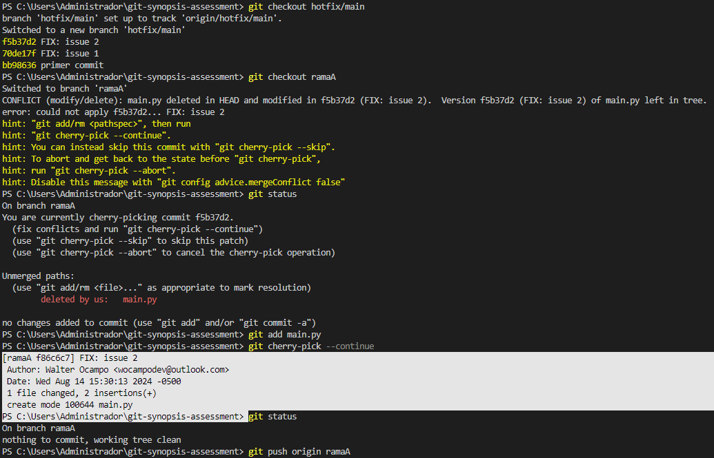

6. Ejemplifique el uso de git para la modificación de ficheros en la rama A y en la rama B simultaneamente sin generar commits en el historial de cambios.

    Para no generar commit a archivos que todavía no hayamos terminado, utilizaremos el comando git stash para guardarlos en una pila y así poder cambiar de rama 

    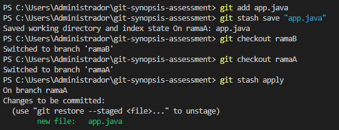

7. Ejemplifique el uso de git para la generación y publicación de un nuevo release (versión) de su código.

    Utilizaremos el comando git tag para atribuirle una etiqueta que nos permite generar una versión del código

    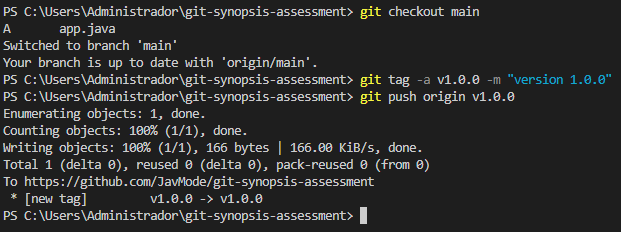

## EXTRAS

1. Ejemplique el uso de git para devolver un fichero del staging area al estado anterior.

    Con el comando git reset podemos devolver ficheros del staging area

    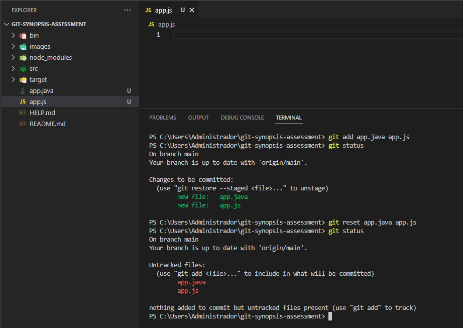

2. Ejemplifique el uso de git para regresar en el tiempo hacia un commit anterior en la rama A de su repositorio remoto propio.

    Con el comando git log --oneline escogeremos una versión del commit que queramos regresar, luego usaremos git reset --hard para reemplazar todos los archivos de nuestro directorio al estado que hayamos escogido

    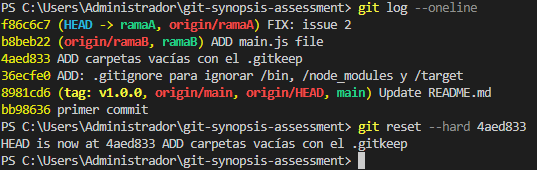