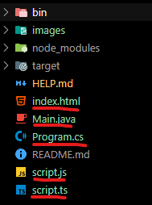

# Solución

## SEGUNDO CAMBIO TIENE QUE APARECER 

## Actividad 1

1. Primero clone el repositorio, seguidamente navegue al directorio "git-synospsis-assessment" hice algunas pruebas para que las imagenes se puedan adjuntar claramente en el fichero "HELP.md", todo esto en mi copia que hice con el fork, acontinuación, presento procedimiento:

    
    

Luego, iniciamos con la actividad 1 : 

2. Hice Y

    ...
