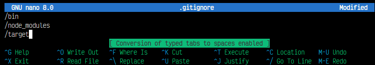
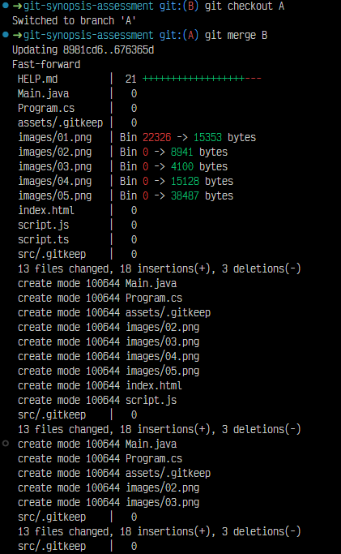

# Solución

## Actividad 1

1. Genere un rama nueva con **git checkout -b**
    [01](./images/01.png)

2. Con **touch** generé los ficheros **(.js | .ts | .java | .cs | .html | etc)**.
    

## Actividad 2

1. Generé un .gitignore con **touch** y lo abrí desde la terminal con **nano**.

    

2. Cambié el contenido de **.gitignore**, para que restrinja a las carpetas **/bin /node_modules y /target** del historial de cambios.
    

## Actividad 3

1. Generé 2 carpetas cualquiera sin contenido con **mkdir** que sean incluidas en el historial de cambios con **.gitkeep** y comprobarlo con **git status**.

    

## Actividad 4

1. Generé una nueva rama B con **git checkout -b**

    

2. Realicé cambios en la rama B, los agregue con **git add .**, luego guarde con **git commit -m**.

    

3. Retorene a la rama A e hice merge con **git merge** para fusionarlo con la rama B

    

## Actividad 5
