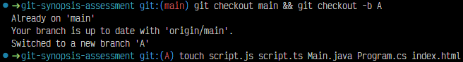
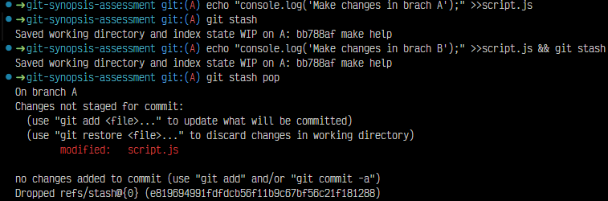

# Solución

## PASO A PASO EL PROCEDIMIENTO

## Actividad 1

1. Primero clone el repositorio, seguidamente navegue al directorio "git-synospsis-assessment" hice algunas pruebas para que las imagenes se puedan adjuntar claramente en el fichero "HELP.md", todo esto en mi copia que hice con el fork, acontinuación, presento procedimiento:

    
    

Luego, iniciamos con la actividad 1 : 
Para crear una nueva rama debemos estar asegurarnos de estar en la rama principal y que este actualizada:
    

Seguidamente, creamos la nueva rama llamada "A"  y verificamos la creación y que estamos usando esta nueva rama:
    

Pot último, cree los ficheros "script.js", "styles.css" y el "index.html":
    

2. Primeramente, para poder restringir del historial de cambios a carpetas especificas, debems necesitar un archivo adicional ".gitignore". Debemos crear este fichero y luego dentro escribir lo que queresmos ignorar, a continuación:

    
    

Luego , para comprobar si toma en cuenta estos archivos hacemos un "git status" si existe algun archivo con esa ruta. Segun la documentación, si no se ve en el indice de Git, es buena practica y para inconvenientes futuros, borrar el indice de Git con : 

   
   

3. Para poder crear las carpetas utilizamos "mkdir" y revisando documentación, se nos indica que Git no rastrea carpetas vacias por defecto, por esta razón existe un sencilla técnica que es crear carpetas de tipo  ".gitkeep" dentro de las carpetas vacias. De esta manera puedan ser tomadas en cuenta, a continuación: 
    

4. Creamos nuestra nueva rama "B"  con el comando "-b" y nos aseguramos que nos encontramos dentro de la nueva rama. A continuación:
  

Seguidamente, creamos un fichero de texto como manera de cambio y diferentes a la rama "A", esta vez utilizare el comando "echo" para tener algo dentro de este texto, de forma más rápida. A cotninuación:

   

Luego, adiciono mi cambios al staggin area con add y el commit correspondiente de mis cambios  que realice en la rama B (agregue imagenes, modifiwue una letra y cree un fichero). 

   

Por último, hacemos un merge desde Git para unir los cambios de la rama B a la rama A, para eso volvemos ala rama A y hacemos "merge", a continuación: 

   

5. Para poder agregar el commit FIX: issues 2 a nuestra rama A, primero ingresamoa la rama "hotfix/main", luego  mediante el comando log tenemos que identificar el hash del commmit, a continuación : 

    

Luego, de saber el identificador ingresamos mediante el "cherry-pick" a ese identificador y vemos que una conflicto: 
    

Seguidamente, ingresamos a nuestro fichero en conflicto y solucionamos co ayuda del IDE o manual combinado o borrando: 
    

Luego, despues de solucionar podemos borrar el archivo: 
    

Por último, comprobamos si existe algun conflicot otra vez y vemos si se agrego a nuestra rama A: 
    

6. Para poder ejemplificar cambios simultaneos en la rama A y B, in hacer commit, utilizamos el comaando "git stash" que guarda de forma temporal cambios. Primero en la rama A, hacemos un cambio o modificación, para luego addicionarlo al staggin area y luego palciar  "git stash" que lo gurada temporalmente. A continuación: 
    

Después, de igual manera en B, modificamos y guardamos: 
    

Por último regresamos A, donde aplicamos con "git stash pop" lo que se guardo temporalmente y de iguala manera en B. Esto permite hacer cambios sin hacer commits de forma simultanea en ambas ramas. 
    
    

7. Para crear una versión debemos estar en la rama principal y  actualizada, a continuación:
    

Luego,  creamos el tag y hacemos el push al repositorio.
    

## EXTRAS

1. Para delvolver un fichero del staggin area al estado anterior podemos usar "git restore". Para este ejemplo crearemos un fichero de ejemplo "Extra.txt".
Luego, agregamos el ficheroa al Stagging area, pero si decidimos no inlcuir el fichero en el proximo commit. Podemos devolverlo al estado anterio con "git restor" con "--stage" nos indica que este archivo sera separado y dejado atras en el directorio sin cambios. 

2. Para poder regresa a un commit anterior podemos utilizar el "git reset". Este comando nos permite movernos a la rama commit deseado y podemos elegir entren mantener o descartar los cambios en el directorio trabajo y el staggin area.

Para poder usar, primero, debemos obtener el hash o identificador del commit deseaso. 

Seguidamente, mediante este comando podemos elegir entre:

- "git reset --soft <id>, si quereemos mantener los cambios en el Staging area y el directorio de trabajo.
- "git reset --mixed <id>, si queremos mantener los cambios en el directorio de trabajo, pero quita los cambios del staging area.

- "git reset --hard <id>, si quereemos descartar todos los cambios del staging area y el directorio de trabajo.

