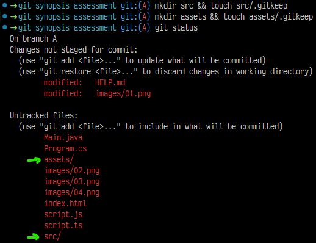
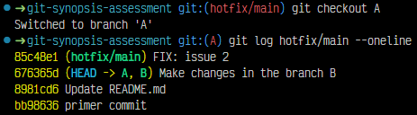
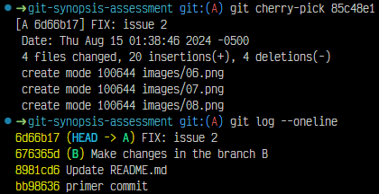
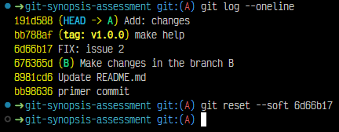

# Solución

## Actividad 1

1. Para realizar el fork , me dirigi a github (abrindo el enlace al proyecto) y 
    me ubique en el btn fork en la parte superior del btn verde de code, le di click.
    Me consultaba si     deseaba hacer el fork y le di en crear fork.
    
    
2. Para clonar el repositorio en mi directorio de trabajo local, realizo lo siguiente:
    Primero abri el VSC y abri una nueva terminal
    
    me ubique el la carpeta donde deseo
    guardar la carpeta a clonar.
    Usando: 
        cd desktop
        ls
        cd DGIT 
        
3. Despues utilizando git clone https://github.com/LunaWilfredo/git-synopsis-assessment.git 
    realizo el clonado.
    
4. Para realizar la creacion de las ramas correspondientes , valido las ramas creadas en el projecto
    utlizando git branch -l para listar las ramas.
    
5. Ahora creamos la rama de trabajo previo a la creacion de las ramas solicitadas,
    utilizando git branch feature/luna
    
6. Ahora ingresamos dentro de la rama creada y creamos las ramas solicitadas para el ejercicio
    
    con git bramch rama-A y git branch rama-B creamos las ramas
    
7. Ahora ingresamos en la rama-A donde crearemos los ficheros necesarios
    con git checkout rama-A
    
8. dentro de la rama-A creamos los ficheros manualmente
    
9. Para limitar las carpetas de modificacion creamos el archivo .gitignore y colocamos: 
    /bin
    /node_modules
    /target
las carpetas a las que deseamos restringir los cambios

10. creamos las carpetas de manera manual sin contenido alguno, o utilizamos mkdir dir-A , mkdir dir-B

11. Realizamos un git add . para guardar todos lso cambios y archivos creados. Y con git status validamos los cambios guardados.

Validamos la rama-B anteriormente creada con git branch -l.

12. Ahora realizamos el commit con git commit -m "FIX:issue 2" para realizar el commit de la rama A con el nombre indicado. en la rama hotfix/main.

