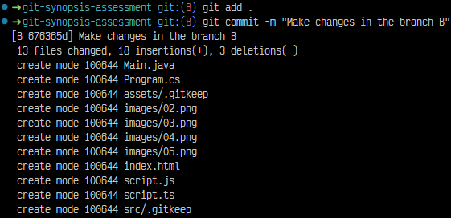
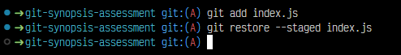

# Solución

## Actividad 1

1. Genere una nueva rama A en base a main con **git checkout -b** y genere ficheros con **touch**.

    

2. Se agregaron los siguientes ficheros (script.js | script.ts | Main.java | Program.cs | index.html | etc).

    

## Actividad 2

1. Generé un .gitignore con **touch** y lo abrí desde la terminal con **nano**.

    

2. Cambié el contenido de **.gitignore**, para que restrinja a las carpetas **/bin /node_modules y /target** del historial de cambios.
    

## Actividad 3

1. Generé 2 carpetas cualquiera sin contenido con **mkdir** que sean incluidas en el historial de cambios con **.gitkeep** y comprobarlo con **git status**.

    

## Actividad 4

1. Generé una nueva rama B con **git checkout -b**

    

2. Realicé cambios en la rama B, los agregue con **git add .**, luego guarde con **git commit -m**.

    

3. Retorene a la rama A e hice merge con **git merge** para fusionarlo con la rama B

    

## Actividad 5

1. Busque el commit con nombre **FIX: issue 2**

    

2. Integré la ese commit de la rama **hotfix/main** en la rama A y luego lo verifique.

    

## Actividad 6

1. Ejemplifique el uso de git para la modificación de ficheros en la rama A y en la rama B simultaneamente sin generar commits en el historial de cambios.

    

## Actividad 7

1. Asignar una etiqueta con el número de versión y push de la etiqueta al repositorio remoto

    

## Extra 1

1. Para devolverlo del staging area y restaurarlo al estado anterior en tu directorio de trabajo.

    

## Extra 2

1. Verifiqué los commits en la rama A y si quiero regresar a un commit anterio uso **git reset**

    
