# Evaluación Git y Github

## Consideraciones

# Generar un **fork** de este repositorio a su propia cuenta de Github.
*En el repositorio remoto principal, haremos un fork para crear una copia del proyecto hacia nuestro repositorio remoto personal*

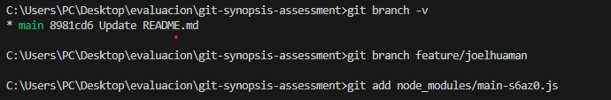

*Luego copiamos la direccion de nuestro repositorio personal y hacemos un `git clone`  para copiar todo el directorio a nuestra pc*

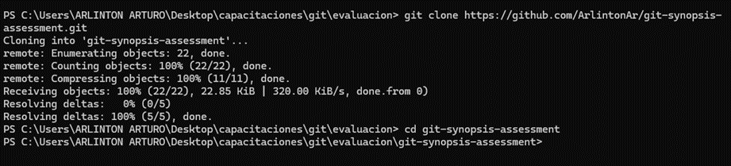

*Verifico que ramas tengo actualmente al momento de clonar el repositorio con el comando `git branch -r`*

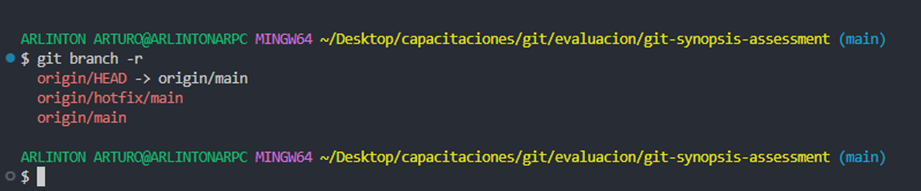

# Genere una **nueva rama A** en base a **main** y agregar los ficheros que considere necesarios. *(.js | .ts | .java | .cs | .html | etc)*.

*Agregando nueva rama y moviendonos a ella con los comandos `git branch A/main` y `git checkout A/main`*

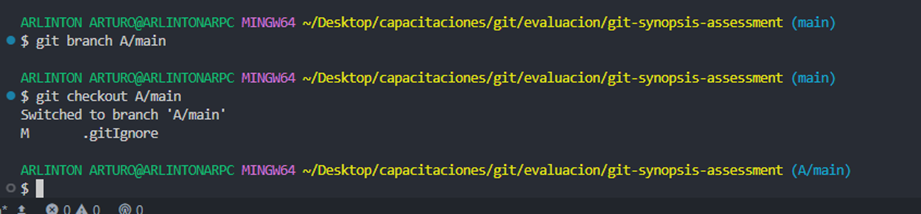

*Agregando ficheros a nuestra nueva rama*

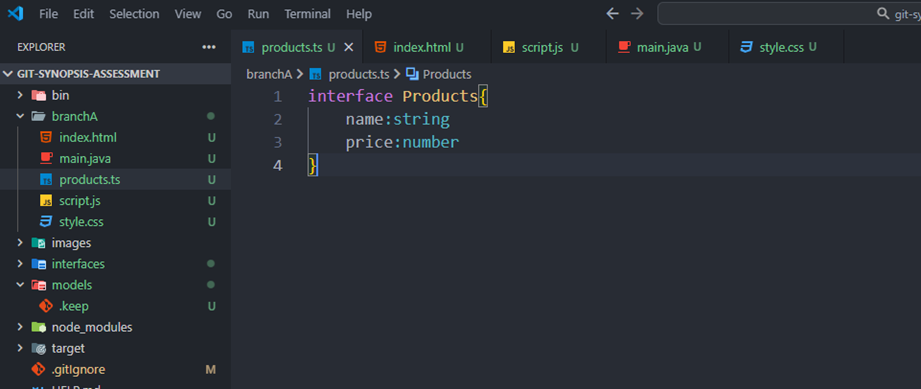

*Una vez termina la tarea de crear los ficheros, agrego todos al "Staging Area"*

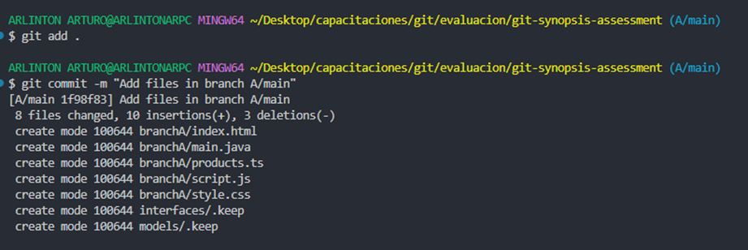

# Restringir del historial de cambios a las carpetas **/bin** **/node_modules** y **/target**.

*Creo un archivo ".gitIgnore" para ignorar nuestras carpetas indicadas*

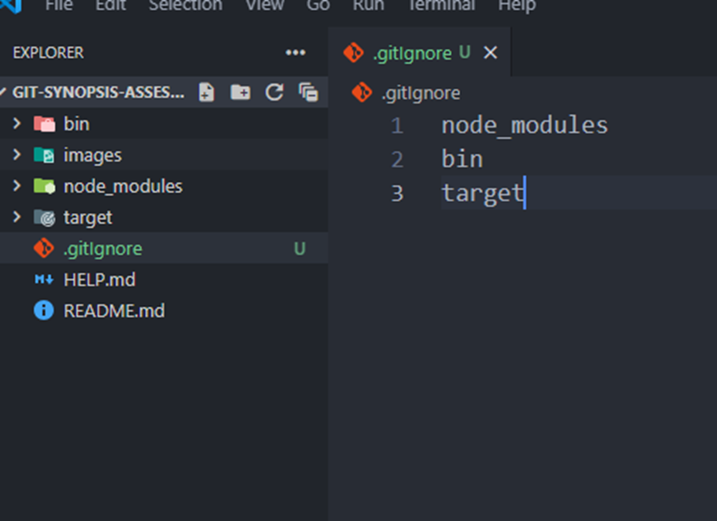

# Generar 2 carpetas cualquiera sin contenido que sean incluidas en el historial de cambios.

*Creando las carpetas que se pide y luego se agrega el archivo con extension ".keep" para incluir en el historial*

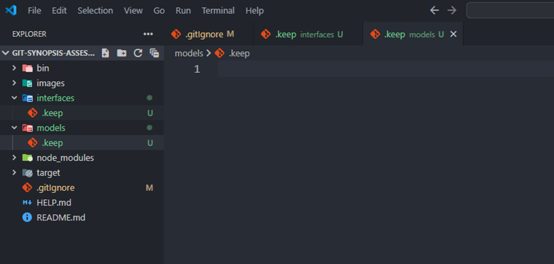

# Generar **otra rama B** para realizar nuevas modificaciones y luego integrar estos en la **rama A**.

*Volver a la rama "main" para crear la nueva rama B/main*

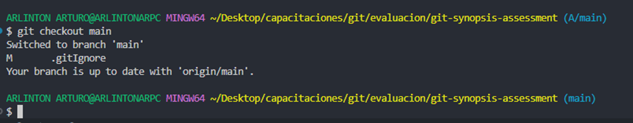

*Ahora crearemos la nueva rama y nos moveremos hacia ella*

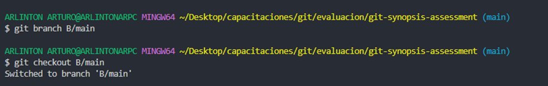

*Para traer el contenido de la rama A/main a nuestra rama actual usaremos `git merge A/main`*

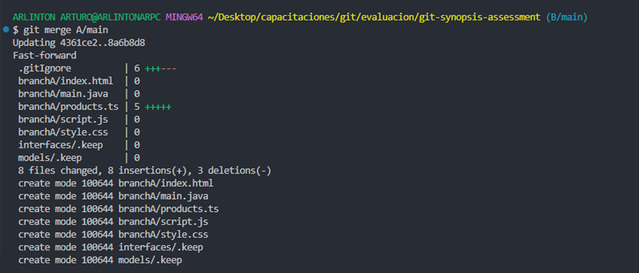

*Con este nuevo contenido en la rama B/main podemos modificar o agregar código*

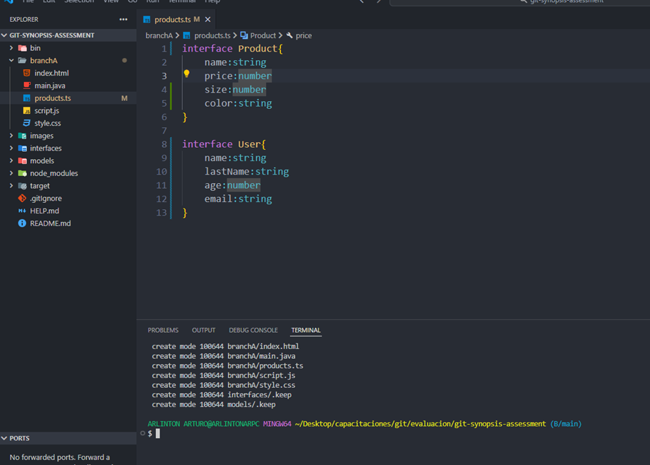

*Ahora agregaremos el nuevo contenido de nuestra rama al "Staging Area"*

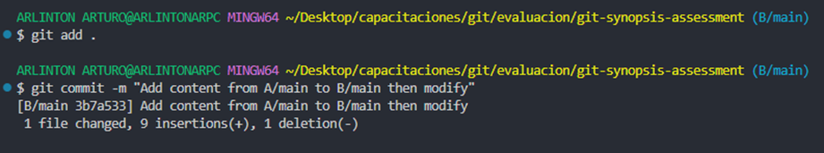

*Por último para integrar las modificaciones de B hacia A nos movemos a la rama A/main y ejecutamos `git merge B/main`*

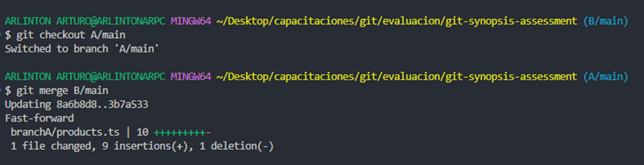

# Integrar **SOLO** el commit con nombre *"FIX: issue 2"* de la rama **hotfix/main** en la **rama A**.

*Para realizar esta tarea lo primero es cambiarnos a la rama "hotfix/main" y verificar cual es el commit en cuestión*

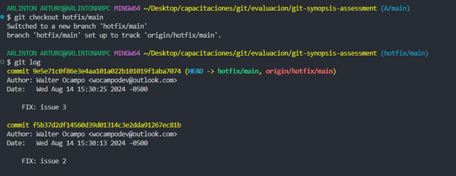
*Identificamos el "FIX: issue 2" el cual tiene un identificador de los cuales tomaré los primeros 6 dígitos*

*Luego de esta tarea me moveré a la rama de destino en este caso A/main*

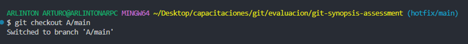

*Ahora para unir el commit específico usaremos `git cherry-pick f5b37d2`*

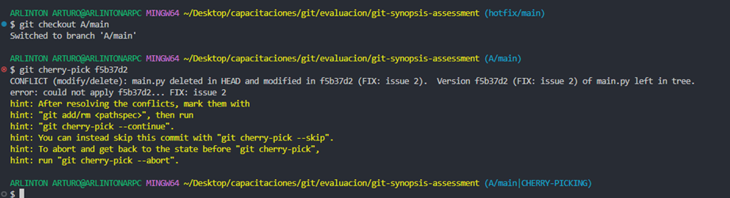

*Resolviendo conflictos*

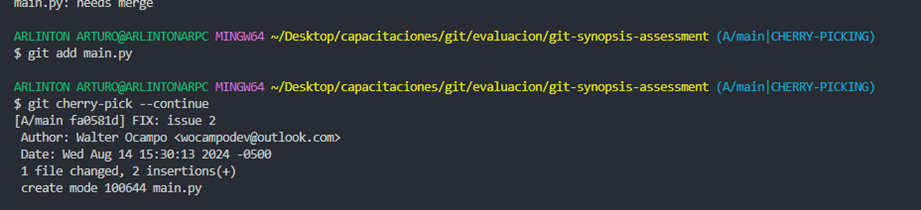

# Ejemplifique el uso de git para la modificación de ficheros en la rama A y en la rama B simultaneamente **sin generar commits en el historial de cambios**.

# Ejemplifique el uso de git para la generación y publicación de un **nuevo release (versión)** de su código.

## Extras

1. Ejemplique el uso de git para devolver un fichero del **staging area** al estado anterior.

2. Ejemplifique el uso de git para regresar en el tiempo hacia un **commit anterior en la rama A** de su repositorio remoto propio.

    - Investigar sobre **git reset**
